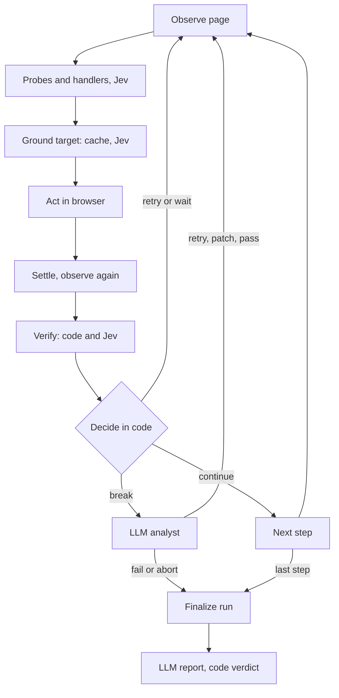

# ARGUS — AI-driven HMI QA platform: product design & implementation spec

2026-09-21 · @Someone

## Summary

ARGUS (working name) is a Docker-packaged platform that tests web HMIs from plain-language descriptions. Jev makes the fast, typed navigation decisions. An LLM is reserved for three moments: compiling the test, judging a break, and writing the report.

Code stays in control of every run. The compiled script is versioned data. Jev answers atomic typed questions (which element, is the step done, is something wrong) with probabilities and confidence, and fixed thresholds turn those numbers into continue or break. The LLM never drives the browser: it receives a break packet or the finished run ledger and returns a schema-validated decision or report.

| Component | Role |
| --- | --- |
| Compiler | One LLM call: natural language to a validated, versioned, diffable TestScript (JSON) |
| Runner | Headless Chromium container: step loop, observation capture, screenshot ring buffer, classic vision checks |
| Navigator | Jev adapter: element grounding, step-done checks, anomaly probes; continue or break decided in code from confidence |
| Analyst | LLM adapter: break triage (retry, patch, continue, fail, abort) and the final run report |
| Control plane and console | Tests, suites, runs, review UI, baselines, defects, RBAC, metering, billing |
| CLI and CI kit | `argus run`, JUnit XML, exit codes, GitLab CI component, merge-request comments |

Three deployment modes share the same images. Cloud hosts everything. Hybrid keeps the control plane hosted and puts the runner inside the customer network with outbound-only traffic. On-prem installs the full stack with Docker Compose or Helm, a bring-your-own LLM endpoint and an offline licence.

Billing is a monthly plan, prepaid credits, or both, on one credit ledger that meters steps, escalations, reports and compiles. A green 25-step run costs 25 to 50 Jev calls and one LLM call; an LLM-per-step agent would spend 25 or more multimodal LLM calls on the same run.

This tab is the product design. System design and contracts: [Architecture and contracts](02-architecture-and-contracts.md). Modules with provable gates for the implementing agent: [Implementation spec](03-implementation-spec.md).

## Users, use cases and scope

ARGUS targets teams that ship browser-based operator screens and cannot let a regression reach the control room.

| Buyer | Pain today | What ARGUS gives them |
| --- | --- | --- |
| Industrial software vendors and integrators (SCADA web clients, WMS/WCS, baggage and cargo control, MES) | Selector-based tests break on every layout change; manual FAT/SAT campaigns cost days per release | Plain-language regression suites that survive relabelled or moved controls, plus an evidence pack per run |
| Operations IT with HMIs on private networks | The HMI cannot be exposed to a SaaS tester | Hybrid runner inside the network, outbound-only |
| Product QA teams on web back-offices | Want CI-gated smoke tests without owning selectors | CLI, GitLab component, JUnit output |
| Regulated or sovereignty-bound sites (airports, energy, pharma, defence) | No page content may leave the site | On-prem edition, bring-your-own LLM, air-gap kit |

### In scope for v1

- Web HMIs rendered in Chromium: DOM and SVG synoptics natively, canvas synoptics through OCR and a vision fallback.
- Functional paths, semantic state assertions, visual regression, indicator checks (colour, blink), console and network health.
- Stimulus hooks: HTTP calls to a simulator or test harness, so a test can raise the alarm it then checks.
- CI gating (GitLab first), scheduled runs, human review, defect triage and issue creation.

### Non-goals for v1

- Native desktop HMIs (WinCC, Qt, WPF) and mobile apps. A later RDP/VNC screen driver can reuse the same contracts.
- Load, security and penetration testing.
- Script-less exploratory testing. The engine follows a compiled path.
- Writing to live equipment. Production environments are read-only by default.

### Positioning

| Approach | Where it falls short | ARGUS answer |
| --- | --- | --- |
| Scripted selectors (Playwright, Selenium, Cypress) | Selector upkeep; blind to meaning, so a "Communication lost" banner passes if the element exists | Intent-based grounding and semantic assertions; stable locators are cached for speed |
| LLM-agent testers (one multimodal LLM call per step) | Seconds per step, high cost, non-deterministic, hard to audit | Typed Jev decisions with calibrated confidence, thresholds in code, LLM only on a break |
| Record-and-replay with silent self-healing | Heals without telling anyone; cannot explain a failure | Every heal and adjudication is recorded and needs approval to persist |

## How a run works

A run is a fixed loop: observe, ground, act, verify, decide. Jev answers inside the loop. The LLM is called only when the loop breaks, and once at the end.

### Author and compile, once per test version

1. The user writes the test in plain language, for example: *"Log in as operator. Open the conveyor overview. Start conveyor C12 and check its status turns to Running within 10 seconds with a green indicator. Trigger a jam on C12 through the simulator. Check that a Jam alarm for C12 appears in the alarm list and blinks until acknowledged."*
2. The Compiler makes one LLM call and returns a TestScript: ordered steps, each with an intent, an action, a target description and literal expectations.
3. Deterministic lint rejects vague or unsafe scripts. Ambiguity it cannot resolve comes back as clarifying questions, not guesses.
4. The console renders the JSON as a readable step list by template, with no LLM involved. The user approves and the version is frozen under a content hash.

### Execute, every run



The loop never hands control to a model: each model answer is a number that code compares to a threshold.

| Stage | Decided by | What happens |
| --- | --- | --- |
| Observe | Code | Accessibility tree, candidate elements with context labels, visible text, console and network events, before-screenshot. A ring buffer keeps the last 30 s of frames. |
| Probes and handlers | Jev (Noul) | Standard probes (error UI, login lost, blocking modal, still loading) plus the script's own handlers, such as "cookie banner visible" |
| Ground | Cache, then Jev (Choice + Noul) | The stored locator is tried first. Otherwise Jev picks among at most 60 pre-filtered candidates and a Noul confirms the pick is a true match. |
| Act | Code | Playwright performs the action. Secrets are injected here and nowhere else. |
| Settle | Code (vision) | Waits for network quiet and frame stability outside masked regions |
| Verify | Code and Jev | Numbers, text, colour, blink and pixel checks run in code. Semantic expectations go to Jev as Nouls. |
| Decide | Code | Thresholds scaled by action risk give continue, retry, wait, run handler or break |

### Continue or break

| Signal | Continue when | Otherwise break as |
| --- | --- | --- |
| Grounding (Choice confidence, confirming Noul) | Confidence at or above the risk threshold and Noul at or above 0.80 | `GROUNDING_AMBIGUOUS`, `TARGET_NOT_FOUND` |
| Semantic expectation (Noul) | At or above 0.80 | `EXPECTATION_UNCERTAIN` between 0.20 and 0.80, `EXPECTATION_FAILED` at or below 0.20 |
| Standard probes (Noul) | All at or below 0.20 | `UNEXPECTED_ERROR_UI`, `AUTH_LOST`, `BLOCKING_MODAL` |
| Deterministic checks | All pass | `ASSERTION_FAILED`, `VISUAL_DIFF`, `NO_EFFECT`, `TIMEOUT`, `ACTION_ERROR` |

These thresholds are starting defaults. They are calibrated per pinned Jev version by the evaluation harness, because TypeSafe advises pinning a version when thresholds are tuned against it ([Models](https://docs.typesafe.ai/models)).

### On a break

The runner sends the Analyst a break packet: the step, the break reason, Jev's answers, the last observations, three to six ring-buffer frames, console and network excerpts, and the step history. The Analyst returns one typed decision.

| Decision | Effect | Allowed when |
| --- | --- | --- |
| `RETRY_STEP` | Re-run the step from Observe | Always, within the retry budget |
| `PATCH` | Run up to three allow-listed actions to get back on the path, then retry | Always; actions are validated like script steps |
| `RESOLVE_TARGET` | Pick one of the top candidates listed in the packet; the step is flagged *adjudicated* | Ambiguous grounding breaks only |
| `MARK_PASSED` | Treat the break as a false alarm; step and run are flagged *adjudicated* | Uncertainty breaks only; disabled in strict mode |
| `MARK_FAILED_CONTINUE` | Record a defect, continue with the next step | Step is not marked critical |
| `MARK_FAILED_ABORT` | Record a defect, stop the run | Always |
| `ABORT_ENV` | Stop without blaming the product: environment down, data missing | Always |

Each decision carries a classification (product defect, test drift, environment, transient) and a rationale tied to evidence. A run allows five escalations by default; past that it breaks as `BUDGET_EXHAUSTED`.

### At the end

Code computes the verdict from step outcomes: `passed`, `failed`, `broken`, `aborted` or `canceled`, with the flags *adjudicated* and *healed*. The Analyst then writes the report from the run ledger and key frames: summary, defects with evidence, adjudications, healed locators, maintenance suggestions. The LLM describes the verdict; it cannot change it.

Jev is cheap enough to ask at every step. At $0.042 per million input tokens with free output ([Models](https://docs.typesafe.ai/models)), 50 calls of 6,000 tokens cost about $0.013 per run.

## Product surface

Three surfaces cover the job: the console for authoring and review, the CLI and API for pipelines, and notifications for everyone else.

### Authoring

- Plain-language editor with a project glossary ("C12 is conveyor 12", "ack means acknowledge") and reusable fragments such as "Log in as operator".
- Compile view: source on the left, rendered steps on the right, lint findings and clarifying questions inline, diff between versions.
- Expert mode: edit the TestScript as YAML with live schema validation.
- Environments: base URL, kind (dev, staging, production, ephemeral), allow-listed origins, secrets, viewport, locale, datasets for data-driven tests.
- Dry run: execute once against an environment to validate grounding before approval. It also seeds the locator memory.
- Suites: tagged sets of tests with parallelism, ordering and cron schedules.

### Run review

- Run list filtered by suite, branch, environment, verdict and flags.
- Step timeline with before and after screenshots, the ring-buffer filmstrip, Playwright trace, video, console and network logs.
- Decision inspector: each Jev question, its probabilities and confidence, the threshold applied and the decision that followed.
- Escalation view: the break packet, the Analyst's decision, classification and rationale.
- Visual diff viewer: baseline, actual and overlay, with approve-baseline and add-mask actions.
- Healed locators: approve to persist, or reject to open a test-drift task.
- Defect triage: status, comments, one-click GitLab or Jira issue with evidence links, de-duplication by failure signature across runs.
- Trends: pass rate, flakiness per step, duration outliers, credits per run.

### CI and API

The `argus` CLI starts runs, waits, writes JUnit XML and a JSON summary, and exits with a code a pipeline can gate on.

```yaml
hmi-qa:
  stage: test
  image: argusqa/cli:1
  variables:
    ARGUS_TOKEN: $ARGUS_CI_TOKEN   # masked project variable
  script:
    - argus run --suite smoke --env review --base-url "$CI_ENVIRONMENT_URL" --wait --junit argus-junit.xml
  artifacts:
    when: always
    reports:
      junit: argus-junit.xml
```

| Exit code | Meaning |
| --- | --- |
| 0 | Every run passed; adjudicated runs count as passed unless `--strict` |
| 1 | At least one run failed |
| 2 | At least one run broken or aborted: test or environment problem |
| 3 | Usage or configuration error |
| 4 | Insufficient credits or quota |
| 5 | Timed out waiting for runs |

- GitLab first: CI component, merge-request note with verdict and failed steps, commit status, JUnit in the MR test widget.
- Ephemeral runner mode: the job starts a runner inside the pipeline network, so review apps and compose stacks that exist only in the job are reachable.
- REST API with an OpenAPI document and scoped tokens. Webhooks (`run.finished`, `defect.created`, `credits.low`) are signed with HMAC-SHA256.
- GitHub Actions, Jenkins and Azure DevOps wrap the same CLI later.

### Notifications

Email, Slack, Teams and generic webhooks, with per-suite rules: on failure, on recovery, on adjudicated pass, on low credits.

## Editions, deployment and pricing

One set of images ships in three deployment modes. A plan sets features and concurrency, credits meter usage, and a customer can pay monthly, prepay, or both.

All prices are proposed list prices in EUR excluding VAT, to validate with five to ten design partners before launch.

### Deployment modes

| Mode | Control plane and console | Runner | Brain (Jev and LLM calls) | What leaves the customer network |
| --- | --- | --- | --- | --- |
| Cloud | ARGUS cloud, EU region | ARGUS cloud, one container per run | ARGUS cloud, managed keys | Not applicable: the target is internet-reachable |
| Hybrid, managed AI | ARGUS cloud | Customer network, outbound HTTPS only | ARGUS cloud, managed keys | Redacted page digests, break frames, artifacts |
| Hybrid, private AI | ARGUS cloud | Customer network | Customer network, own keys and endpoints | Run metadata and verdicts; artifacts stay in a local store |
| On-prem | Customer site, Compose or Helm | Customer site | Customer site, own LLM endpoint | Nothing, or only the Jev API call through an allow-listed egress |

TypeSafe documents Jev as a hosted API (`POST /v1/systemone`) with zero data retention for enterprise accounts ([Models](https://docs.typesafe.ai/models)). For air-gapped sites ARGUS ships a local Navigator adapter. A small open-weight model behind an OpenAI-compatible endpoint answers the same typed questions from constrained choices and token log-probabilities. It must pass the same evaluation gates as Jev before a site may enable it.

### Plans, monthly subscription

| Plan | EUR per month | Credits included per month | Parallel runs | Seats | Runners | Retention | Adds |
| --- | --- | --- | --- | --- | --- | --- | --- |
| Pay-as-you-go | 0 | None, packs only | 1 | 2 | Cloud | 14 days | API, CLI, GitLab CI |
| Starter | 79 | 8,000 | 2 | 5 | Cloud | 30 days | Schedules, Slack, Teams, webhooks |
| Team | 349 | 40,000 | 6 | 15 | Cloud and 3 self-hosted | 90 days | Hybrid runners, baseline workflow, OIDC SSO, own AI keys, Jira and GitLab issues |
| Business | 1,190 | 150,000 | 20 | Unlimited | Cloud and unlimited self-hosted | 12 months | SAML and SCIM, audit log, private-AI hybrid, local artifact store, priority support |

Annual billing costs ten months. The trial grants 1,000 credits for 14 days with no card. Plan credits reset monthly; Team and Business roll over up to one month of unused credits.

### Prepaid credit packs

| Pack (credits) | EUR | EUR per credit |
| --- | --- | --- |
| 10,000 | 120 | 0.0120 |
| 50,000 | 550 | 0.0110 |
| 250,000 | 2,500 | 0.0100 |
| 1,000,000 | 9,000 | 0.0090 |

Packs work on every plan including Pay-as-you-go, stay valid 12 months, and are consumed after plan credits. Auto top-up buys a chosen pack when the balance drops under a threshold. A hard spend cap stops runs instead of billing more, if the customer prefers.

### Rate card

| Operation | Credits, managed AI | Credits, own AI keys |
| --- | --- | --- |
| Executed step, including Jev decisions, DOM checks and classic vision | 1 | 0.5 |
| AI vision assertion or vision grounding (multimodal LLM) | 5 | 1 |
| Analyst escalation | 10 | 2 |
| Run report | 10 | 2 |
| Compile or recompile a test | 15 | 3 |
| Cloud runner time, per started minute | 1 | 1 |
| Self-hosted runner time | 0 | 0 |

A premium analyst model multiplies the three LLM operations by 2.5. A green 25-step, 3-minute cloud run costs 25 + 3 + 10 = 38 credits: EUR 0.30 on Business, 0.33 on Team, 0.38 on Starter, 0.46 on the smallest pack. One break adds 10 credits. Starter therefore covers about 210 such runs a month, Team 1,050, Business 3,900.

### Enterprise on-prem

| Item | EUR per year |
| --- | --- |
| Platform licence: 5 parallel run slots, all features, LTS releases | 30,000 |
| Extra parallel slot | 3,000 |
| Air-gap kit: offline licence, image bundle, local Navigator adapter | 10,000 |
| Premium support: 4-hour response, named engineer | 20% of licence |

AI is bring-your-own on-prem, so the flat licence consumes no credits. The metered alternative is a EUR 12,000 base plus prepaid credit vouchers at the own-keys rate, loaded as signed files. Both use the same signed licence and a hash-chained local usage ledger, reconciled at renewal.

### Unit economics

| Operation | Revenue at EUR 0.009 per credit | Estimated cost (EUR) | Basis |
| --- | --- | --- | --- |
| Step | 0.009 | 0.0005 | Two Jev calls of about 6,000 tokens at $0.042 per million ([Models](https://docs.typesafe.ai/models)) |
| Cloud runner minute | 0.009 | 0.002 | 2 vCPU, 4 GB container; assumption |
| Escalation | 0.09 | 0.02 to 0.03 | About 18,000 input tokens with four frames, 800 output; assumption below |
| Report | 0.09 | 0.02 | About 15,000 input, 1,500 output tokens |
| Compile | 0.135 | 0.02 | About 6,000 input, 3,000 output tokens |

LLM costs assume a fast multimodal model near $1 per million input tokens and $5 per million output tokens; this is an assumption to refresh at launch. The 38-credit green run then earns about EUR 0.34 against EUR 0.04 of direct cost. The target is a blended gross margin of at least 75% after hosting and support.

Stripe Billing handles subscriptions, Stripe Checkout handles packs, with card and SEPA and Stripe Tax for EU VAT. Enterprise pays by invoice. The ARGUS credit ledger is the source of truth; Stripe only moves money.

## Risks, assumptions and open questions

The largest risk is Jev's fit for element grounding on real HMI screens. The evaluation harness (module M19) exists to measure that before anything else is polished.

| Risk | Why it matters | Mitigation |
| --- | --- | --- |
| Grounding accuracy on dense HMI screens is unproven | Jev is text-only and loses accuracy when the state carries irrelevant detail ([jaggedness](https://docs.typesafe.ai/model-jaggedness/jev-1.13)) | Pre-filter to 60 candidates, context labels per candidate, two-stage confirmation, a live gate of at least 95% grounding accuracy on the fixture set; the Navigator is a port, so the adapter can change |
| Non-English HMIs, French labels included | English is Jev's primary language; other languages score lower ([Models](https://docs.typesafe.ai/models)) | Compiler writes intents and expectations in English, page text stays as is; per-language evaluation set; doubt routes to the Analyst |
| Jev is a hosted API whose limits "can change without notice" | On-prem and air-gap editions cannot depend on it alone | Local Navigator adapter behind the same port, version pinning, backoff, degrade to Analyst grounding at a higher credit cost |
| Canvas and WebGL synoptics have no DOM | The accessibility tree is empty where the HMI matters most | OCR candidates, set-of-marks vision grounding, and a vendor guide asking for `data-testid` and ARIA on SVG |
| Live animation defeats frame stability and pixel diffs | HMIs blink, scroll and tick constantly | Masks, per-region stability, blink as a first-class assertion, DOM-quiet fallback |
| Prompt injection from page content | Jev does not treat state as hostile by default ([jaggedness](https://docs.typesafe.ai/model-jaggedness/jev-1.13)); page text also reaches the Analyst | Closed action set, origin allow-list, patch validation, read-only production, injection test suite in M18 |
| A test clicks a real actuator | Safety and liability | Environment kinds, read-only production default, risk-tiered thresholds, explicit per-step `allowInProduction`, contract clause |
| LLM cost drift | Escalations and reports carry thinner margins than steps | Token budgets enforced as gates, model tier multiplier, own-keys rate |
| Analyst overrides erode trust | A QA tool that talks itself into green is worthless | Verdict computed by code; `MARK_PASSED` limited to uncertainty breaks, always flagged, off under `--strict` |

### Assumptions

- Targets are web HMIs that render correctly in Chromium.
- The cloud edition is hosted in the EU.
- One language end to end, TypeScript, with JSON Schema as the contract source of truth.
- TypeSafe's terms allow embedding Jev in a commercial SaaS and reselling managed usage. This is unverified.

### Open questions

- [ ] Confirm with TypeSafe: embedding and resale terms, enterprise rate limits, zero data retention, any private-deployment roadmap.
- [ ] Pick the default Analyst model per tier and the open-weight model for the local Navigator adapter.
- [ ] Choose the product name; ARGUS is a placeholder and widely used.
- [ ] Which HMI stacks do the first design partners run: DOM, SVG or canvas? This decides how early vision grounding must land.
- [ ] Do industrial buyers accept per-credit metering, or do they expect per-site licences?
- [ ] Compliance scope for v1: GDPR DPA only, or also ISO 27001 and IEC 62443 alignment statements?

## Sources

TypeSafe documentation pages opened on 21 September 2026. Everything about Jev in this doc comes from them; all prices, thresholds and cost estimates for ARGUS are this design's own proposals.

- [Introduction](https://docs.typesafe.ai/introduction): System One model, the Choice, Score and Noul primitives, atomic questions composed in code
- [State](https://docs.typesafe.ai/concepts/state.md): text-only input, string, object or array state
- [Models](https://docs.typesafe.ai/models.md): `jev-1.13.0`, price, rate limits, 64k context, version pinning, language support, data handling
- [API reference](https://docs.typesafe.ai/api.md): `POST /v1/systemone`, question and answer shapes, 255 options per Choice, error codes
- [Confidence](https://docs.typesafe.ai/confidence.md): confidence derived from probabilities, thresholds scaled by risk
- [Jev 1.13 jaggedness](https://docs.typesafe.ai/model-jaggedness/jev-1.13.md): literal reading, numbers and dates in code, large-state distraction, Choice versus Noul
- [Agent skill](https://docs.typesafe.ai/agent-skill.md): coding-agent skill, questions and thresholds kept in one file
- [JavaScript SDK client config](https://docs.typesafe.ai/sdk/javascript/api/interfaces/TypeSafeClientConfig.md): `baseURL` and custom `fetch`, used to point the SDK at the fake Jev server
