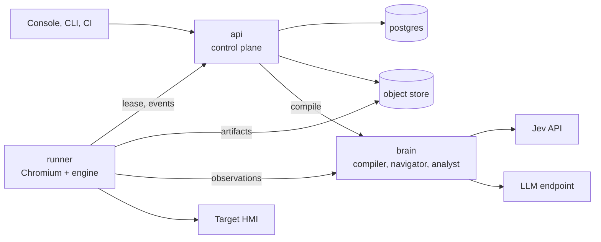
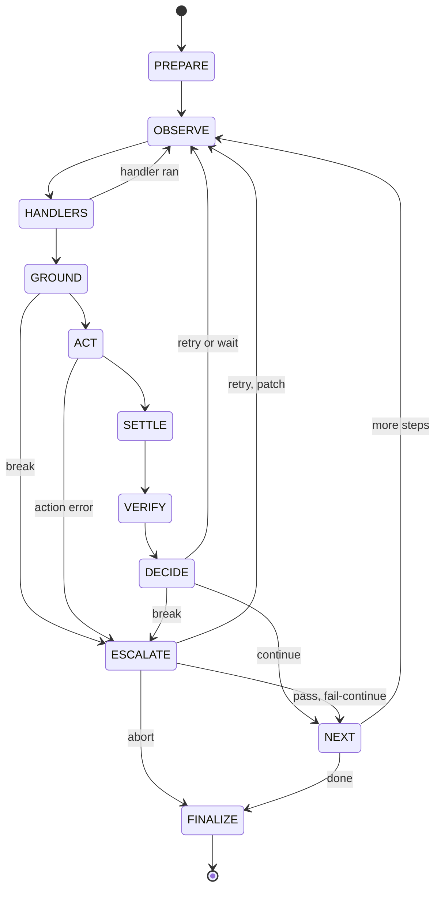
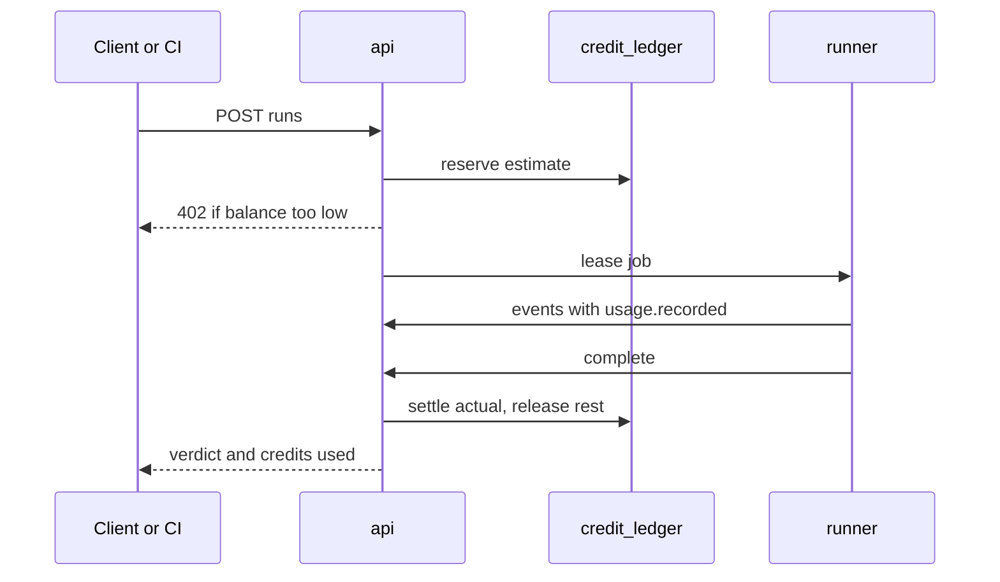

# Architecture and contracts

ARGUS is six containers around one rule: the runner owns the browser, the brain owns the models, the control plane owns the record.

## System architecture

Six containers make the whole product, and every edition is a different placement of the same six.



The runner is the only container that touches the target, and the brain is the only one that holds model credentials.

| Container | Image | Responsibility | State |
| --- | --- | --- | --- |
| `api` | `argus/api` | REST API, auth and RBAC, tests, suites, scheduler and queue, run ledger, metering, billing, webhooks, live event stream | Stateless |
| `web` | `argus/web` | Console single-page app behind nginx, reverse proxy to `api` | Stateless |
| `brain` | `argus/brain` | Compiler, Navigator and Analyst behind one internal HTTP API; provider adapters, question and prompt catalogues, redaction check, AI usage events | Stateless |
| `runner` | `argus/runner` | Headless Chromium, run engine, observer, screenshot ring buffer, vision toolkit, artifact upload | Ephemeral per run |
| `postgres` | `postgres:16` | Metadata, job queue (`SKIP LOCKED`), credit ledger, audit log | Durable |
| `objectstore` | MinIO or any S3 API | Screenshots, frames, traces, videos, reports, baselines | Durable |

### Trust boundaries

- Runner to control plane: outbound HTTPS only. The runner long-polls for a lease, posts event batches and uploads artifacts to pre-signed URLs. No inbound port is opened on the customer side.
- Runner to brain: mutual authentication with a per-run token minted by `api`. The token carries the org, the run id and an expiry, and scopes every brain call for metering.
- Brain to providers: the only egress that carries page-derived text. Redaction runs in the runner before data leaves it, and the brain re-checks it.
- Secrets never reach the brain. The runner resolves them at action time and masks their values in observations, logs and frames.

### Topology per edition

| Edition | `api`, `web`, `postgres`, `objectstore` | `brain` | `runner` |
| --- | --- | --- | --- |
| Cloud | ARGUS cloud | ARGUS cloud | ARGUS cloud, Kubernetes Job per run |
| Hybrid, managed AI | ARGUS cloud | ARGUS cloud | Customer host, `docker run` or Compose |
| Hybrid, private AI | ARGUS cloud; optional local `objectstore` | Customer host | Customer host |
| On-prem | Customer site, one Compose file or Helm chart | Customer site | Customer site |
| CI ephemeral | Any of the above | Same as the edition | Inside the CI job, exits after the suite |

### Runner protocol

| Call | Direction | Purpose |
| --- | --- | --- |
| `POST /runner/v1/register` | Runner to api | Exchange the runner token for a short-lived session JWT; declare slots, labels, version |
| `POST /runner/v1/lease` | Runner to api | Long-poll up to 30 s; returns a job (script, environment, policy, run token) or 204 |
| `POST /runner/v1/runs/{id}/heartbeat` | Runner to api | Every 15 s; renews the lease; the response carries cancel signals |
| `POST /runner/v1/runs/{id}/events` | Runner to api | NDJSON batches of run events with sequence numbers; idempotent on `(run, seq)` |
| `POST /runner/v1/runs/{id}/artifacts` | Runner to api | Returns pre-signed PUT URLs; the runner uploads directly to the object store |
| `POST /runner/v1/runs/{id}/complete` | Runner to api | Final outcome and usage counters; triggers verdict, settlement and notifications |

A lease that misses three heartbeats expires. The run is re-queued at most twice, then marked `broken` with reason `RUNNER_LOST`. If the control plane is unreachable the runner spools events and artifacts to disk and replays them in order.

## Stack decisions

One language end to end, TypeScript on Node 22 LTS, keeps the contracts shared and the implementing agent on a single toolchain.

| Concern | Choice | Reason |
| --- | --- | --- |
| Language and runtime | TypeScript 5 strict, Node 22 LTS | Playwright and the TypeSafe SDK are first-class in JavaScript; API, runner, console and CLI share contract types |
| Monorepo | pnpm workspaces, Turborepo | Deterministic installs, cached per-package gates |
| Contracts | TypeBox, exporting TypeScript types and JSON Schema 2020-12 | One source for validation, OpenAPI and other-language clients |
| API | Fastify 5, OpenAPI 3.1 generated from the schemas | Schema-first, little ceremony |
| Database | PostgreSQL 16, Kysely, forward-only SQL migrations | Row-level security for tenancy, `SKIP LOCKED` queue, no ORM magic |
| Queue and live events | Postgres `SKIP LOCKED` and `LISTEN/NOTIFY` behind a `Queue` port | Two fewer containers on-prem; NATS can replace it in cloud |
| Object storage | S3 API through AWS SDK v3; MinIO on-prem | One code path everywhere |
| Browser | Playwright with bundled Chromium; CDP screencast feeds the ring buffer | Tracing, network interception, stable automation |
| Vision | `sharp`, `pixelmatch`, SSIM, dHash, Tesseract 5 binary | Deterministic, no GPU, fits in the runner image |
| Jev | `@typesafe-ai/sdk`, model pinned to `jev-1.13.0` | Official retries and types; `baseURL` points at the fake in tests |
| LLM | `LlmProvider` port with an Anthropic adapter and an OpenAI-compatible adapter (Azure, vLLM, Ollama, Mistral) | Customer choice, sovereignty, air gap |
| Console | React 19, Vite, TanStack Query and Router, Tailwind | Common and well known to coding agents |
| CLI | Node package plus `argus/cli` image | Runs in any CI image |
| Tests | Vitest with fast-check for unit, contract and property tests; Playwright Test for console end-to-end | One tool per layer |
| Packaging | Multi-arch images (amd64, arm64), non-root, Compose bundles, Helm chart | Seamless install |
| Observability | OpenTelemetry traces and metrics, Prometheus endpoint, pino JSON logs | Works on-prem without a vendor |
| Billing and licensing | Stripe Billing, Checkout and Tax; Ed25519-signed licence files on-prem | Standard money path; offline-verifiable entitlements |

### Two structural rules

- Ports and adapters everywhere. Browser, Jev, LLM, clock, id generator, queue, object store, payments and mail each sit behind an interface in `src/ports`, with a fake in `packages/testkit`. Adapters are wired only in `apps/*/src/main.ts`; dependency-cruiser enforces it as a gate.
- Deterministic replay. The run engine takes `Clock` and `IdGenerator` ports, so a run against fakes produces a byte-identical ledger. Golden-ledger gates depend on this.

## Run engine

The engine is a deterministic state machine. Its only non-deterministic inputs are observations and model answers, and both are written to the run ledger before they are used.



Every transition emits one ledger event, so a run can be replayed and audited state by state.

| State | Produces | Ports used | On failure |
| --- | --- | --- | --- |
| `PREPARE` | Browser context, resolved variables, armed handlers, ring buffer started | Browser, Secrets | Run `broken`, reason `SETUP_FAILED` |
| `OBSERVE` | `Observation` | Browser, Vision | Two retries, then break `OBSERVE_FAILED` |
| `HANDLERS` | Fired handler or none | Navigator | Capped at 3 firings per step, 10 per run |
| `GROUND` | `ResolvedTarget` with its source: `cache`, `jev` or `vision` | LocatorMemory, Navigator, Analyst | Break |
| `ACT` | Action result | Browser | One retry on a detached or covered element, then `ACTION_ERROR` |
| `SETTLE` | Settled flag and duration | Browser, Vision | Never fails; a timeout is recorded |
| `VERIFY` | `CheckResult[]` | Navigator, Vision, code | Not applicable |
| `DECIDE` | `Decision` | None: pure function | Not applicable |
| `ESCALATE` | `AnalystDecision` | Analyst | Analyst down: step `broken`, reason `ANALYST_UNAVAILABLE` |
| `FINALIZE` | Verdict, report, flushed artifacts | Analyst, ObjectStore | A failed report never changes the verdict |

### Grounding gate

1. Locator memory: accept when exactly one element matches and its descriptor fingerprint similarity is at least 0.90. Source is `cache`, no model call.
2. Jev stage one: a Choice over the candidates plus a `target_present` Noul. Accept when confidence is at least `t_ground` for the step's risk class and the Noul is at least `t_yes`.
3. Jev stage two, when confidence sits between `t_floor` and `t_ground`, and always for critical steps: one confirming Noul per top-three candidate. Accept when exactly one reaches `t_yes` and the others stay under 0.50.
4. Otherwise break: `TARGET_NOT_FOUND` when `target_present` is at most `t_no`, else `GROUNDING_AMBIGUOUS`.

Stage two follows TypeSafe's advice that a Choice is relative and a Noul absolute, so ranking and acceptance are asked separately ([jaggedness](https://docs.typesafe.ai/model-jaggedness/jev-1.13.md)).

### Decision function

`decide(input, profile)` is pure and total. Rules are evaluated in this order and the first match wins.

| # | Condition | Decision |
| --- | --- | --- |
| 1 | Action error after its one retry | `BREAK(ACTION_ERROR)` |
| 2 | Probe `auth_lost` at least `t_probe` | `RUN_HANDLER(relogin)` if defined, else `BREAK(AUTH_LOST)` |
| 3 | Probe `blocking_modal` at least `t_probe` | Matching handler, else `BREAK(BLOCKING_MODAL)` |
| 4 | Probe `error_ui` at least `t_probe` and the step does not expect an error | `BREAK(UNEXPECTED_ERROR_UI)` |
| 5 | Probe `loading` at least `t_probe` and wait budget remains | `WAIT` |
| 6 | A deterministic check fails | `WAIT` while the step's `within` window is open, else `BREAK(ASSERTION_FAILED)` or `BREAK(VISUAL_DIFF)` |
| 7 | A Noul expectation is at most `t_no` | `WAIT` while the window is open, else `BREAK(EXPECTATION_FAILED)` |
| 8 | A Noul expectation lies between `t_no` and `t_yes` | `WAIT` while the window is open, else `BREAK(EXPECTATION_UNCERTAIN)` |
| 9 | The action should change the page, digest and frames did not change, no expectation passed | `RETRY` once, then `BREAK(NO_EFFECT)` |
| 10 | Console or network errors and the policy forbids them | `BREAK(CONSOLE_OR_NETWORK_ERROR)` |
| 11 | None of the above | `CONTINUE` |

### Threshold profile

Defaults live in one versioned file per pinned model, `thresholds/jev-1.13.0.json`, and are recalibrated by module M19.

| Parameter | Read steps (navigate, hover, assert) | Write steps (click, fill, select) | Critical steps |
| --- | --- | --- | --- |
| `t_ground`, Choice confidence | 0.60 | 0.75 | 0.90, stage two always |
| `t_floor`, Choice confidence | 0.35 | 0.45 | 0.60 |
| `t_yes`, Noul | 0.80 | 0.80 | 0.90 |
| `t_no`, Noul | 0.20 | 0.20 | 0.10 |
| `t_probe`, Noul | 0.70 | 0.70 | 0.70 |

Code assigns the risk class, never a model: the compiler maps action types, lint forces `critical` on a project verb list (delete, stop, reset, purge, emergency), and the author can raise it.

### Budgets

| Budget | Default |
| --- | --- |
| Step retries | 2 |
| Step `within` window | 10 s, maximum 120 s |
| Poll interval | 250 ms for code conditions; 1 s for Jev conditions, 60 polls maximum |
| Escalations | 2 per step, 5 per run |
| Patch actions | 3 per escalation |
| Step timeout, run timeout | 60 s, 15 min |
| Ring buffer | 2 frames per second, 60 frames, JPEG quality 60; flushed on break, failure or `artifacts: full` |
| Blink burst | 12 frames per second for 3 s on the target's bounding box; the 2 frames per second ring buffer cannot measure a 1 Hz blink |

### Verdict function

`verdict(ledger)` is pure. Precedence: `canceled`, then `failed` (any step failed and the classification is not test drift or environment), then `broken` (grounding failure, action error, test drift, budget exhausted, runner lost), then `aborted` (`ABORT_ENV`), else `passed`. Flags: `adjudicated` when any step used `MARK_PASSED`, `healed` when any grounding replaced a cached locator.

### Locator memory

Keyed by project, test lineage, step id and environment. It stores up to three locators in priority order (`data-testid`, role with accessible name, stable CSS path) and a descriptor fingerprint. A first successful run seeds it automatically. A heal is stored as pending until a reviewer approves it, unless the project sets `healApproval: auto`.

## Contract: TestScript

A TestScript is frozen, self-contained data: it names what to do and what must be true, never how to find an element. JSON is canonical; the console shows it as YAML.

```yaml
apiVersion: argus/v1
kind: TestScript
metadata:
  name: conveyor-start-and-jam
  title: Start C12 and handle a jam
  tags: [smoke, conveyors]
  sourceHash: sha256:9f2c...          # hash of the plain-language source
  compiler: { model: analyst-standard, promptVersion: c-3 }
target:
  baseUrl: ${env.BASE_URL}
  viewport: { width: 1920, height: 1080 }
  locale: en-GB
  timezone: Europe/Paris
policy:
  strict: false
  onBreak: escalate                   # escalate | fail | skip
  failOnConsoleError: false
  shareScreenshotsWithLlm: on-break   # never | on-break | always
  artifacts: on-failure               # on-failure | full
variables: { conveyor: C12 }
secrets: [OPERATOR_PASSWORD]          # names only, never values
handlers:
  - id: h-relogin
    when: { kind: probe, name: auth_lost }
    steps: [ { id: h-relogin-1, use: login-operator } ]
steps:
  - id: s1
    use: login-operator               # fragment, inlined at compile time
  - id: s2
    intent: Open the conveyor overview
    action:
      type: click
      target: { description: Navigation entry that opens the conveyor overview }
    expect:
      - kind: dom
        target: { description: Row of conveyor C12 in the conveyor table }
        op: exists
  - id: s3
    intent: Start conveyor C12
    risk: write
    action:
      type: click
      target:
        description: Start button in the row of conveyor C12
        hints: { role: button, text: Start, near: C12 }
    within: 10s
    expect:
      - kind: dom
        target: { description: Status cell in the row of conveyor C12 }
        op: textEquals
        value: Running
      - kind: color
        target: { description: Status indicator in the row of conveyor C12 }
        op: is
        value: green
  - id: s4
    intent: Trigger a jam on C12 through the simulator
    action:
      type: http
      request: { method: POST, url: "${env.SIM_URL}/conveyors/C12/faults", json: { type: jam } }
      expectStatus: 202
  - id: s5
    intent: Check the jam alarm appears and blinks
    action: { type: assert }
    within: 15s
    expect:
      - kind: noul
        statement: The alarm list contains an active jam alarm for conveyor C12.
      - kind: blink
        target: { description: Alarm row for the jam on conveyor C12 }
        minHz: 0.5
        maxHz: 3
  - id: s6
    intent: Acknowledge the alarm
    action:
      type: click
      target: { description: Acknowledge button of the jam alarm for conveyor C12 }
    within: 5s
    expect:
      - kind: blink
        target: { description: Alarm row for the jam on conveyor C12 }
        op: absent
  - id: s7
    intent: Compare the overview with its baseline
    action: { type: assert }
    expect:
      - kind: visual
        baseline: overview-c12-running
        maxDiffRatio: 0.01
        masks: [ { description: Clock in the header }, { description: Alarm list } ]
```

### Actions

| Type | Fields |
| --- | --- |
| `navigate` | `url`, relative or inside the origin allow-list |
| `click`, `dblclick`, `rightclick`, `hover`, `check`, `uncheck` | `target` |
| `fill`, `clear`, `select` | `target`, `value` or `option`; secrets only as `${secret.NAME}` |
| `press` | `keys`, optional `target` |
| `upload` | `target`, `file` reference |
| `drag` | `source`, `destination` targets |
| `scroll` | `target` or page, direction, amount |
| `wait`, `assert` | No browser action; expectations only |
| `extract` | `target`, `into` variable, `parse`: text, number or regex |
| `http` | `request`, `expectStatus`, optional `into`; host must be allow-listed |

A `target` holds a required literal `description`, optional `hints` (`role`, `text`, `label`, `testId`, `near`, `region`), an optional `frame`, and an optional explicit `locator` that bypasses AI grounding.

### Expectations

| Kind | Evaluated by | Fields |
| --- | --- | --- |
| `noul` | Jev | `statement`: one literal, self-contained claim in English; optional `criteria` for true and false |
| `dom` | Code | `target`; `op`: exists, absent, visible, enabled, disabled, textEquals, textContains, textMatches, valueEquals, numberCompare with tolerance, countEquals |
| `url` | Code | equals, contains, matches |
| `color` | Code, vision | `target`; `is` or `isNot`; palette: red, amber, yellow, green, blue, grey, white, black |
| `blink` | Code, vision | `target`; `minHz` and `maxHz`, or `op: absent` |
| `visual` | Code, vision | `baseline`, `maxDiffRatio`, `masks` |
| `vision` | Multimodal LLM | `question`, `expected`; billed as an AI vision operation |
| `console`, `network` | Code | No errors matching a pattern; no responses at or above 500 |
| `a11y` | Code | axe-core rule set and impact threshold |

Numbers, counts, dates and colours are checked in code because TypeSafe lists them as weak spots for Jev ([jaggedness](https://docs.typesafe.ai/model-jaggedness/jev-1.13.md)).

### Lint rules

| Rule | Check |
| --- | --- |
| L1 | Every acting step has a `target.description` of at least three words and no pronouns |
| L2 | A `noul` statement is declarative, makes one claim, and contains no numeric comparison, count or date |
| L3 | No secret value inline; password fields take `${secret.*}` only |
| L4 | URLs are relative or inside the environment allow-list |
| L5 | Steps whose intent uses a verb from the project's critical list carry `risk: critical` |
| L6 | `within` is at most 120 s and the worst-case duration fits the run timeout |
| L7 | Baseline names are unique per test; every mask has a description or a rectangle |
| L8 | Step ids are unique, and stable across recompiles when the intent is unchanged, so locator memory survives |

The schema is published at `/schemas/argus/v1/test-script.schema.json`. Changes inside `v1` are additive only.

## Contract: Observation and Navigator

The Observer turns a page into small, named text. The Navigator turns a step plus that text into Jev questions, and Jev's numbers into a typed result. Jev accepts text only, so nothing visual is sent to it ([State](https://docs.typesafe.ai/concepts/state.md)).

### Observation

```json
{
  "obsId": "obs_01J8", "ts": "2026-09-21T10:15:03.120Z",
  "url": "https://hmi.test/overview", "title": "Conveyor overview",
  "page": {
    "headings": ["Conveyor overview", "Alarms"],
    "dialogs": [], "alerts": ["Communication OK"],
    "loading": { "inflightRequests": 0, "spinners": 0 },
    "textDigest": "Conveyor overview | C11 Stopped | C12 Stopped | Alarms: none"
  },
  "candidates": [
    { "cid": "c17", "role": "button", "name": "Start", "tag": "button",
      "state": { "enabled": true },
      "context": { "row": "C12 | Stopped | 0.0 m/s", "region": "Conveyor table", "labels": ["Conveyor C12"] },
      "attrs": { "data-testid": "start-c12" },
      "bbox": [1412, 388, 96, 32], "color": "grey", "source": "dom",
      "fingerprint": "fp_3b9a" }
  ],
  "console": [], "network": [],
  "frames": { "before": "art://runs/r1/s3/before.png", "ringHead": 412 },
  "digestHash": "sha256:5d1e"
}
```

- Candidates come from the accessibility tree and the DOM: controls, links, rows, cells, SVG nodes with a role or title, elements with click listeners. Canvas regions add OCR words with `source: ocr`.
- Context labels are computed in code: table row text, nearest heading, fieldset legend, `label for`, `aria-labelledby`, enclosing panel title. They are what separates twenty identical Start buttons.
- Colours arrive as palette names, never hex values. `bbox`, `attrs` and `fingerprint` stay in the runner and are not sent to Jev.
- Budgets: grounding state at most 6,000 tokens, verification state at most 8,000. Jev allows 32k for the state plus the longest question ([Models](https://docs.typesafe.ai/models.md)).
- Redaction runs before anything leaves the runner: password inputs, project mask selectors, exact secret values, and e-mail or IBAN patterns under `pii: strict`.

### Pre-filter

A deterministic ranker scores each candidate on hint matches (role, token overlap of name and context with the description, `testId`, `near`, `region`) plus visible and enabled bonuses. The top 60 go to Jev, well under its limit of 255 options per Choice ([API reference](https://docs.typesafe.ai/api.md)).

### Grounding request

```json
{
  "model": "jev-1.13.0",
  "state": {
    "step": { "intent": "Start conveyor C12", "action": "click",
              "target": "Start button in the row of conveyor C12",
              "hints": { "role": "button", "text": "Start", "near": "C12" } },
    "candidates": {
      "c17": { "role": "button", "name": "Start", "row": "C12 | Stopped | 0.0 m/s", "region": "Conveyor table" },
      "c16": { "role": "button", "name": "Start", "row": "C11 | Stopped | 0.0 m/s", "region": "Conveyor table" }
    }
  },
  "questions": {
    "target": {
      "type": "choice",
      "instructions": "Which option is the user-interface element described by `step.target`? Use `step.hints` and each option's row and region to tell similar elements apart.",
      "criteria": { "c17": "button Start; row C12 | Stopped | 0.0 m/s; region Conveyor table",
                    "c16": "button Start; row C11 | Stopped | 0.0 m/s; region Conveyor table" }
    },
    "target_present": {
      "type": "noul",
      "instructions": "Does `candidates` contain the user-interface element described by `step.target`?",
      "criteria": { "true": "At least one candidate is the described element.",
                    "false": "No candidate is the described element." }
    }
  }
}
```

Descriptors are repeated inside the Choice criteria so Jev reads each option directly instead of hopping from a key into the state.

### Question catalogue

All question text lives in one file, `packages/navigator/src/questions.ts`, and all thresholds in `thresholds/`. TypeSafe recommends this so a human can review both, and warns that coding agents write questions poorly ([Agent skill](https://docs.typesafe.ai/agent-skill.md)).

| Id | Type | Asked | Instruction, abridged | Feeds |
| --- | --- | --- | --- | --- |
| `target` | Choice | Grounding stage one | Which option is the element described by `step.target`? | Grounding gate |
| `target_present` | Noul | Grounding stage one | Does `candidates` contain the described element? | Gate, `TARGET_NOT_FOUND` |
| `confirm_a`, `confirm_b`, `confirm_c` | Noul | Stage two, top three with full descriptors and neighbours | Is `top.a` the element described by `step.target`? | Grounding gate |
| `expect_i` | Noul | Verify | "Considering only `after`:" plus the script's statement | Rules 7 and 8 |
| `probe_error_ui` | Noul | Every verify | Does `after` show an error message, error dialog or failure notification? | Rule 4 |
| `probe_auth_lost` | Noul | Every verify | Does `after` show a login form or a session-expired message? | Rule 2 |
| `probe_blocking_modal` | Noul | Every verify | Does `after` show a dialog or overlay that blocks the rest of the page? | Rule 3 |
| `probe_loading` | Noul | Every verify | Does `after` show a spinner, skeleton or progress bar? | Rule 5 |
| `screen_kind` | Choice | Steps that declare `expectedScreen` | Expected screen, other screen of the same application, error or blank page, external site | `OFF_PATH` |
| `handler_<id>` | Noul | Scripts with handlers | The handler's `when` statement | `HANDLERS` state |

One verify request carries every expectation, probe and handler condition of the step. Jev evaluates questions in parallel against one state, so the extra questions barely change latency ([Introduction](https://docs.typesafe.ai/introduction)).

### Navigator port

```ts
export interface Navigator {
  ground(req: GroundRequest): Promise<GroundResult>;   // stage one, then stage two if needed
  verify(req: VerifyRequest): Promise<VerifyResult>;   // expectations, probes, handler conditions
}

export interface GroundResult {
  pick: string | null;                      // candidate id
  confidence: number;                       // Choice confidence, 0..1
  probabilities: Record<string, number>;
  targetPresent: number;                    // Noul, 0..1
  confirm?: Record<string, number>;         // stage-two Nouls
  model: string;
  usage: { inputTokens: number };
  latencyMs: number;
  cacheHit: boolean;
}
```

| Adapter | Backend | Notes |
| --- | --- | --- |
| `JevNavigator` | `@typesafe-ai/sdk`, `POST /v1/systemone` | Default. Retries on 429 and 529 within a 10 s budget, then `NAVIGATOR_UNAVAILABLE` |
| `LocalNavigator` | OpenAI-compatible endpoint with log-probabilities | Choice is a softmax over option labels; Noul is P(yes) / (P(yes) + P(no)); confidence is (n x p\_max - 1) / (n - 1) |
| `FakeNavigator` | Scripted answers and cassettes | Hermetic gates |

When the Navigator is unavailable the project policy picks `degrade: analyst`, which asks the Analyst to ground at the AI vision rate, or `fail`.

### Vision grounding for canvas

Inside a canvas region the Observer offers OCR words and detected regions as candidates. If Jev grounding still breaks, the Analyst receives a set-of-marks screenshot with numbered boxes and returns one mark id from that closed set. The runner clicks the centre of the box.

## Contracts: break packet, analyst decision, report, events

The LLM sees closed menus, not open doors: code computes which decisions and patch actions are allowed and rejects anything else.

### BreakPacket

```json
{
  "runId": "run_01J8", "stepId": "s5", "attempt": 1,
  "reason": "EXPECTATION_UNCERTAIN",
  "script": { "title": "Start C12 and handle a jam", "stepIndex": 4, "stepCount": 7,
              "step": { "id": "s5", "intent": "Check the jam alarm appears and blinks" },
              "previousIntents": ["Start conveyor C12", "Trigger a jam on C12 through the simulator"],
              "nextIntent": "Acknowledge the alarm" },
  "signals": { "jev": { "expect_0": 0.46, "probe_error_ui": 0.08 },
               "checks": [ { "kind": "blink", "outcome": "fail", "detail": "0.0 Hz over 6 s" } ],
               "actionError": null, "elapsedMs": 15012 },
  "observations": { "before": { "digestHash": "sha256:5d1e" }, "after": { "digestHash": "sha256:77aa" } },
  "frames": [ { "ref": "art://runs/r1/ring/f408.jpg", "tMs": -3000 } ],
  "console": [], "network": [],
  "allowed": { "decisions": ["RETRY_STEP", "PATCH", "MARK_PASSED", "MARK_FAILED_CONTINUE", "MARK_FAILED_ABORT", "ABORT_ENV"],
               "patchActions": ["click", "press", "scroll", "hover", "wait"],
               "origins": ["https://hmi.test"] },
  "budget": { "escalationsLeft": 4, "patchActionsMax": 3 }
}
```

### Allowed decisions by break reason

| Break reason | `RETRY_STEP` | `PATCH` | `RESOLVE_TARGET` | `MARK_PASSED` | `MARK_FAILED_*` | `ABORT_ENV` |
| --- | --- | --- | --- | --- | --- | --- |
| `GROUNDING_AMBIGUOUS` | yes | yes | yes | no | yes | yes |
| `TARGET_NOT_FOUND`, `AUTH_LOST`, `ACTION_ERROR`, `TIMEOUT` | yes | yes | no | no | yes | yes |
| `EXPECTATION_UNCERTAIN` | yes | yes | no | unless strict | yes | yes |
| `UNEXPECTED_ERROR_UI`, `BLOCKING_MODAL`, `OFF_PATH`, `NO_EFFECT` | yes | yes | no | unless strict | yes | yes |
| `EXPECTATION_FAILED`, `ASSERTION_FAILED`, `VISUAL_DIFF` | yes | no | no | no | yes | yes |

`RESOLVE_TARGET` picks one candidate id from the top candidates listed in the packet and flags the step *adjudicated*.

### AnalystDecision

```json
{
  "decision": "MARK_FAILED_CONTINUE",
  "classification": "PRODUCT_DEFECT",
  "certainty": "high",
  "rationale": "The jam alarm row for C12 is present in all six frames but its background never changes, so it does not blink.",
  "evidence": [ { "frame": "art://runs/r1/ring/f408.jpg", "note": "Alarm row static at t-3 s" } ],
  "patch": [],
  "defect": { "title": "Unacknowledged jam alarm does not blink", "severity": "major",
              "expected": "Alarm row blinks until acknowledged", "actual": "Alarm row is static" },
  "scriptSuggestion": null
}
```

Code validates every decision before acting on it.

- The decision is in `allowed.decisions`; patch actions are in `allowed.patchActions`, within budget, and navigate only inside `allowed.origins`.
- Patch targets are descriptions and pass through the same grounding gate as script steps.
- Every evidence reference exists in the packet. A defect is mandatory for `MARK_FAILED_*` with `PRODUCT_DEFECT`.
- An invalid answer gets one repair attempt carrying the validator errors. A second failure breaks the step as `ANALYST_INVALID`.

### RunReport

```json
{
  "runId": "run_01J8", "verdict": "failed", "flags": { "adjudicated": false, "healed": true },
  "summary": "Six of seven steps ran. Conveyor C12 started and reached Running in 2.1 s. The jam alarm appeared but never blinked.",
  "stats": { "steps": 7, "passed": 5, "failed": 1, "broken": 0, "skipped": 1, "durationMs": 74211,
             "jevCalls": 13, "llmCalls": 2, "credits": 31 },
  "defects": [ { "id": "def_01", "stepId": "s5", "title": "Unacknowledged jam alarm does not blink",
                 "severity": "major", "classification": "PRODUCT_DEFECT", "signature": "sha256:c41b" } ],
  "adjudications": [],
  "heals": [ { "stepId": "s3", "status": "pending" } ],
  "maintenance": [],
  "generatedBy": { "model": "analyst-standard", "promptVersion": "r-2" }
}
```

The LLM's output schema has no `verdict`, `flags` or `stats` fields. Code injects them after the call, so the model cannot alter them. A defect's `signature` hashes the normalised step intent, break reason and top console error, and drives de-duplication across runs.

### Run events

Every event is `{ runId, seq, ts, type, stepId?, data, prev }`. `seq` is gapless per run and `prev` is the SHA-256 of the previous event's canonical JSON, which makes the ledger tamper-evident for acceptance evidence packs.

| Type | Data |
| --- | --- |
| `run.started` | Runner id, script hash, environment, policy, versions of engine, questions, thresholds and models |
| `step.started`, `step.finished` | Attempt; outcome and duration |
| `observation.captured` | Observation id, digest hash, artifact references |
| `navigator.ground` | Request hash, pick, confidence, top five probabilities, `target_present`, stage-two Nouls, source, latency, tokens |
| `navigator.verify` | Answer map, latency, tokens |
| `action.performed` | Type, resolved locator, duration, error |
| `check.evaluated` | Kind, outcome, measured values |
| `decision.made` | Rule number, decision, reason |
| `handler.fired` | Handler id |
| `escalation.requested`, `escalation.decided` | Packet reference; decision, validation result, tokens |
| `artifact.stored` | Kind, reference, bytes, SHA-256 |
| `usage.recorded` | Operation and quantity, the input to metering |
| `run.finished` | Counters and verdict inputs |

The api rejects a gap with 409 and ignores a repeated `(runId, seq)`. Verdict and credit settlement are computed from the ledger alone.

### Analyst and Compiler ports

```ts
export interface Analyst {
  triage(packet: BreakPacket): Promise<AnalystDecision>;
  groundVisually(req: VisualGroundRequest): Promise<VisualGroundResult>;   // set-of-marks, closed set
  assertVisually(req: VisionAssertRequest): Promise<VisionAssertResult>;   // expectation kind: vision
  report(input: ReportInput): Promise<ReportBody>;                         // no verdict, flags or stats
}

export interface Compiler {
  compile(req: CompileRequest): Promise<CompileResult>;
  // CompileResult = { script?: TestScript; lint: LintFinding[]; clarifications: Clarification[]; usage: Usage }
}
```

## Data model and public API

Postgres holds one append-only truth per concern: `run_events` for what happened, `credit_ledger` for what it cost, `audit_log` for who did what. Everything else is a projection or configuration.

### Tables

Every table carries `org_id` and is protected by row-level security.

| Table | Key columns | Notes |
| --- | --- | --- |
| `orgs`, `users`, `memberships` | plan, region, settings; role | Roles: owner, admin, maintainer, runner, viewer, billing |
| `api_tokens` | project scope, `scopes[]`, hash, expiry | SHA-256 hash stored; the token is shown once |
| `projects` | glossary, critical verbs, policy defaults |  |
| `environments` | kind, base URL, `allowed_origins[]`, `allowed_http_hosts[]`, `read_only`, viewport, locale | Production defaults to read-only |
| `secrets` | scope, name, ciphertext, key version, location | Location is `vault` or `runner-local` |
| `fragments` | name, source text, script JSON | Inlined at compile time |
| `tests`, `test_versions` | lineage id, tags; source text and hash, script JSON and hash, compiler metadata, status | A version is immutable once approved |
| `suites`, `suite_tests`, `schedules` | tag selector, parallelism, order; cron, time zone |  |
| `suite_runs`, `runs` | trigger, CI metadata (branch, SHA, pipeline URL), status, verdict, flags, runner, lease, attempts, credits reserved and settled |  |
| `run_events` | `(run_id, seq)` primary key, type, step id, `data jsonb`, `prev_hash` | Append-only, partitioned by month |
| `run_steps`, `escalations` | outcome, attempts, duration, grounding source, break reason; packet reference, decision, validity, tokens | Projections of the ledger |
| `artifacts` | kind, object key, bytes, SHA-256, expiry | Retention follows the plan |
| `baselines` | environment, test lineage, name, object key, masks, status, approver | Pending until approved |
| `locator_memory` | lineage, step, environment, locators, fingerprint, status | Heals wait for approval |
| `reports`, `defects` | report JSON, HTML and JUnit keys; signature, severity, classification, status, occurrences, issue URL | Defects de-duplicate on signature |
| `runners` | labels, token hash, slots, version, last seen, kind | Kinds: cloud, self-hosted, ephemeral |
| `plans`, `subscriptions` | feature flags and limits; Stripe ids, period, status |  |
| `credit_grants` | source (plan, pack, trial, voucher, adjustment), amount, remaining, expiry |  |
| `credit_ledger` | kind (grant, reserve, settle, release, expire, adjust), amount, grant, run, unique idempotency key | Append-only; balance is a sum |
| `usage_events` | run, operation, quantity, rate, credits, AI mode | Input to settlement and usage reports |
| `webhooks`, `webhook_deliveries`, `audit_log` |  | Audit log is append-only |

### REST API

Base path `/api/v1`. JSON bodies, bearer tokens with scopes, `Idempotency-Key` on every POST, cursor pagination, errors as RFC 9457 problem documents with a stable `code`.

| Area | Endpoints |
| --- | --- |
| Tests | `POST /projects/{p}/tests`, `POST /tests/{t}/compile`, `GET /tests/{t}/versions`, `PUT /test-versions/{v}/script`, `POST /test-versions/{v}/approve` |
| Suites and schedules | CRUD on `/suites`, `/schedules` |
| Runs | `POST /projects/{p}/runs` with suite or tests, environment, overrides (`baseUrl`, variables), CI metadata, `strict`; `GET /suite-runs/{id}`; `GET /runs/{id}`; `POST /runs/{id}/cancel` |
| Run data | `GET /runs/{id}/events?after=seq`, also as server-sent events; `GET /runs/{id}/report` as JSON, HTML or JUnit; `GET /runs/{id}/artifacts` |
| Review | `POST /baselines/{id}/approve`, `POST /locator-memory/{id}/approve`, `POST /locator-memory/{id}/reject`, `PATCH /defects/{id}`, `POST /defects/{id}/issue` |
| Environments and secrets | CRUD; secret values are write-only |
| Runners | `POST /runners` returns the token once; `GET /runners`; `DELETE /runners/{id}` |
| Billing | `GET /billing/balance`, `GET /billing/usage`, `POST /billing/checkout`, `POST /billing/portal`, `PUT /billing/limits` for spend cap and auto top-up |
| Administration | Members, roles, tokens, webhooks, audit log, SSO |
| Runner API | `/runner/v1/*`, described under Runner protocol |
| Brain API, internal | `POST /brain/v1/compile`, `/ground`, `/verify`, `/triage`, `/ground-visual`, `/assert-visual`, `/report`; run token or service token |

| Error code | HTTP | Meaning |
| --- | --- | --- |
| `insufficient_credits` | 402 | Balance below the reservation and no overage allowed |
| `quota_exceeded` | 429 | Parallel-run or seat limit of the plan |
| `lint_failed` | 422 | Script violates rules L1 to L8; findings attached |
| `not_approved` | 409 | Test version is still a draft |
| `environment_read_only` | 409 | Script contains write steps and the environment forbids them |
| `origin_not_allowed` | 422 | URL or HTTP host outside the allow-list |

## Metering, credits and licensing

Credits are reserved before a run and settled from its ledger afterwards. Every movement is one idempotent append, and a run is never stopped halfway for billing reasons.



The estimate is steps times the step rate, plus one report, plus two escalations, plus expected runner minutes.

### Ledger rules

- Consumption order: grants with the earliest expiry first; plan grants before pack grants on a tie.
- Idempotency keys: `reserve:{runId}`, `settle:{runId}`, `release:{runId}`, `grant:{stripeEventId}`, `grant:{voucherId}`, `expire:{grantId}`. A replay is a no-op.
- Invariants, property-tested: the balance equals the sum of entries; no grant goes negative; for every run, settle plus release equals reserve unless actual usage exceeded the estimate.
- If actual usage exceeds the reservation the full amount is settled. The org may go negative once, then new runs return 402 until it tops up.
- A run that ends `broken` through a platform fault (cloud runner lost, brain 5xx) is refunded by an `adjust` entry.
- The rate card is data. `rate_cards` rows carry `effective_from`, and each `usage_event` stores the rate applied, so price changes never rewrite history.
- The AI mode (`managed` or `byo`) and the model tier multiplier are resolved per project when the usage event is written.

### Stripe integration

| Event | Effect |
| --- | --- |
| `invoice.paid` for a subscription | Plan grant for the period; expiry at period end plus the plan's rollover |
| `checkout.session.completed` for a pack | Pack grant expiring after 12 months |
| Balance under the auto top-up threshold | Off-session PaymentIntent on the saved method, at most three a day; failure notifies and grants nothing |
| Subscription `past_due` | Seven days of grace, then downgrade to Pay-as-you-go; existing grants stay |

The webhook handler verifies the Stripe signature and is idempotent on the event id.

### On-prem licence

- A licence is a JSON payload with a detached Ed25519 signature. The public key ships inside the images.
- Payload: licence id, customer, edition, features, slots, `not_before`, `not_after`, mode (`flat` or `metered`), `air_gapped`.
- The api verifies it at start and every 24 hours. After expiry, a 30-day grace period shows a banner, then new runs are refused. Stored data stays readable.
- Slots reuse the plan quota code path for parallel runs.
- Metered mode loads signed credit vouchers. Each voucher appends one grant, idempotent on the voucher id.
- `argus licence usage-export` writes a usage report whose hash chain the vendor can verify at renewal. No phone-home exists in air-gapped mode; elsewhere aggregate counters are opt-in.

## Security, privacy and tenancy

ARGUS drives real operator screens with real credentials, so the design assumes three adversaries: a hostile page, a curious neighbouring tenant, and an over-eager model.

| Threat | Control | Proven in |
| --- | --- | --- |
| A test acts on live equipment | Production environments are read-only: the runner refuses everything except navigate, hover, scroll, wait, assert and extract, unless the step sets `allowInProduction` and the environment enables writes. Critical steps use the highest thresholds and always run stage two. | M10, M18 |
| The browser leaves the intended application | Origin allow-list enforced by request interception. A main-frame navigation outside it ends the step as `OFF_PATH`. | M04, M18 |
| SSRF from cloud runners or the `http` action | Cloud runners block loopback, link-local, metadata and private ranges. `http` hosts are allow-listed per environment. | M18, M20 |
| Prompt injection through page text | Page text appears only inside named data fields. Jev answers are closed-set. Analyst answers are schema-validated and limited to the packet's `allowed` lists. Patches pass the same gates as script steps. | M06, M07, M18 |
| Secret leakage | Envelope encryption with AES-256-GCM and per-org data keys. Secrets resolve only in the runner at action time and are scrubbed from observations, events, logs and frames. `runner-local` secrets never leave the site. | M10, M12, M18 |
| Cross-tenant access | Row-level security on `org_id` with a per-request database role. Object keys are org-prefixed and served through short-lived pre-signed URLs. Cloud runs get one non-root container each, read-only root file system, no shared volumes. | M12, M18, M20 |
| Stolen tokens | Tokens are hashed, scoped and expiring. Runner tokens exchange for 15-minute JWTs. Run tokens are bound to one run. CI tokens carry `runs:write` and `runs:read` only. | M12 |
| Tampered evidence | Hash-chained run events, artifact SHA-256 in the ledger, signed report export | M12, M16 |
| Supply chain | SBOM, signed images, vulnerability scan with no critical finding, pinned base images, lockfile integrity | M17 |
| Page data reaching AI providers | Per-project data policy: `shareScreenshotsWithLlm`, `pii`, mask selectors. Redaction runs in the runner and is re-checked in the brain. Private-AI and on-prem modes send nothing to ARGUS-managed providers. | M09, M18 |

### Privacy and compliance

- GDPR: data processing agreement, sub-processor list, EU region, plan-based retention with hard-delete jobs, per-org export and erase endpoints.
- Audit log entries for approvals (baseline, heal, test version), adjudication views, secret changes, token creation and billing changes.
- Single sign-on: OIDC from Team, SAML and SCIM from Business.
- Model providers are configured with zero data retention where they offer it; the configured providers and regions are listed in the console.
