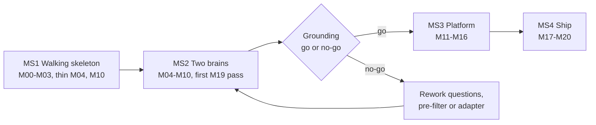

# Implementation spec

Twenty-one modules, M00 to M20, each closed by gates an agent can run and a reviewer can replay.

## How to read this spec

A module is done when its gates pass on a clean checkout, and not before. A gate is a command with a machine-checkable pass condition; no gate reads "looks correct".

Each module below states its purpose, packages, what to build, and a gate table. Contracts, state machines and schemas referenced here are defined in the Architecture and contracts tab and are binding.

### Gate tiers

| Tier | Name | Needs | Runs | Pass rule |
| --- | --- | --- | --- | --- |
| A | Hermetic | Fakes, the fixture HMI, local Postgres and MinIO from Compose; no network | Every commit | Deterministic: exit code 0 and exact expectations |
| B | Live AI | `TYPESAFE_API_KEY` and an LLM key | Nightly, before a release, on demand | Statistical thresholds over fixed datasets; results stored with model ids |
| C | Deployment | Docker daemon, clean host | On main and before a release | The stack comes up from built images and passes system scenarios |

### Gate runner and evidence

`pnpm gate M06` runs the commands listed in `gates/M06.yaml` and writes `gates/evidence/M06.json`. `pnpm gate all --tier A` is the regression suite.

```json
{
  "module": "M06", "commit": "4c1d9e2", "tier": "A", "startedAt": "2026-10-02T09:14:00Z",
  "gates": [
    { "id": "M06-G3", "command": "pnpm --filter @argus/navigator test:gate-g3",
      "exitCode": 0, "durationMs": 8123,
      "metrics": { "tests": 42, "branchCoverage": 100 }, "pass": true }
  ],
  "pass": true,
  "toolVersions": { "node": "22.9.0", "pnpm": "9.12.0" },
  "evidenceHash": "sha256:0b7e"
}
```

### Rules that keep gates honest

- Gates first. The agent commits `gates/Mxx.yaml` and the failing tests before any implementation, and a human approves that commit.
- Protected paths. `gates/**`, `**/__golden__/**`, `thresholds/**`, `prompts/**` and `packages/navigator/src/questions.ts` cannot change in the same merge request as implementation code. CI job `gate-guard` enforces it.
- A wrong gate is a stop condition. The agent opens a `gate-change` request with its reasoning and waits; it never edits the gate to pass.
- Global gate G0 applies to every module: typecheck, lint, unit tests, line coverage of at least 85% for packages and 70% for apps, dependency rules, no `TODO`, `FIXME` or skipped tests, no network in Tier A.
- Pure decision code (`decide`, `verdict`, `groundGate`, ledger arithmetic) also needs a Stryker mutation score of at least 80%, which proves the tests check behaviour and not just execution.

## Build order

Build risk-first in four milestones: prove the loop on fakes, prove Jev grounding live, then build the platform around a loop that works.



The first live grounding evaluation is the only fork in the plan. Everything after it assumes the Navigator meets its accuracy gate.

### Milestones

| Milestone | Modules | Exit condition | Human checkpoint |
| --- | --- | --- | --- |
| MS1 Walking skeleton | M00 to M03, thin slices of M04 and M10 | A hand-written three-step script runs green on the fixture HMI with `FakeNavigator` and leaves a valid hash-chained ledger | Review the repository, the gate harness and the contracts |
| MS2 Two brains | M04 to M10; first M19 pass directly after M06 | The conveyor C12 test compiles from plain language, runs on live Jev, breaks on an injected fault and receives a valid Analyst decision | Grounding go or no-go on M19-G1 and M19-G2; then a review of the break loop |
| MS3 Platform | M11 to M16 | A GitLab job starts a suite through the CLI, a hybrid runner executes it, the console shows it, credits settle | Before Stripe leaves test mode |
| MS4 Ship | M17 to M20 | The on-prem bundle installs on a clean host and scenarios S1 to S12 pass from built images | Release review |

The thin M04 slice is navigate, click, fill, screenshot and DOM candidate extraction. The thin M10 slice is the path OBSERVE, GROUND, ACT, VERIFY, DECIDE with `dom` expectations and no escalation.

### Dependencies

| Module | Name | Depends on | Gate tiers |
| --- | --- | --- | --- |
| M00 | Foundation and gate harness | None | A |
| M01 | Contracts | M00 | A |
| M02 | Fixture HMI | M00 | A, C |
| M03 | AI fakes and cassettes | M01 | A |
| M04 | Browser driver and observer | M01, M02 | A |
| M05 | Vision toolkit | M00 | A |
| M06 | Navigator | M01, M03 | A, B |
| M07 | Analyst | M01, M03 | A, B |
| M08 | Compiler | M01, M03 | A, B |
| M09 | Brain service | M06, M07, M08 | A |
| M10 | Run engine | M04, M05, M06, M07 | A |
| M11 | Runner agent | M09, M10 | A, C |
| M12 | Control plane API | M01 | A |
| M13 | Metering, billing and licensing | M12 | A |
| M14 | Web console | M12 | A, B |
| M15 | CLI and CI kit | M12 | A, C |
| M16 | Reports, notifications and issues | M07, M12 | A |
| M17 | Packaging and deployment | M09, M11 to M16 | C |
| M18 | Security hardening | M17 | A, B |
| M19 | Live evaluation and calibration | M02, M04, M06 for the first pass; M10 for the full pass | B |
| M20 | Cloud operations | M17 | A, C |

A single agent builds in numeric order, with the two exceptions shown in the milestones. After M01, three tracks share no dependency and can run as parallel agent sessions: perception (M02, M04, M05), intelligence (M03, M06 to M09) and platform (M12 to M16, where only M16 waits for M07).

## Foundation modules, M00 to M03

The first four modules build the ground everything else is proven on: the gate harness, the contracts, a fixture HMI with switchable faults, and fakes for both AI backends.

Gate `Mxx-Gn` is the script `test:gate-gn` of the owning package, listed in `gates/Mxx.yaml`. The tables state what each gate proves and its pass condition.

### M00 Foundation and gate harness

A clean clone builds, tests and gates itself with one command, and the harness can catch its own cheating.

Packages: repository root, `tools/gate`, `packages/testkit` (skeleton), `.gitlab-ci.yml`, `compose.dev.yaml`, `docs/adr`, `CLAUDE.md`.

- pnpm workspace, Turborepo pipeline, strict TypeScript base config, ESLint, Prettier, Vitest, and dependency-cruiser rules: `core` imports no adapter, and adapters are wired only in `apps/*/src/main.ts`.
- `tools/gate` reads `gates/Mxx.yaml`, runs each command, records exit code and duration, reads the metrics file the command writes to `$GATE_METRICS`, evaluates the pass expressions and writes the evidence file with its hash.
- Tier A network guard: test setup makes any non-loopback socket throw `NETWORK_DENIED`. Tier A CI jobs also run without egress.
- `gate-guard` CI job for the protected paths, `compose.dev.yaml` with Postgres 16 and MinIO, an ADR template, and `CLAUDE.md` holding the working loop from the last section of this tab.

| Gate | Tier | Proves | Pass condition |
| --- | --- | --- | --- |
| M00-G1 | A | Clean-clone bootstrap | In a fresh container, `pnpm install --frozen-lockfile`, `pnpm build` and `pnpm test` exit 0 in under 10 minutes |
| M00-G2 | A | The gate runner tells the truth | Self-test with three sample gates: passing, failing exit code, exit 0 with a failing metric. Evidence reads pass, fail, fail, and the runner exits non-zero |
| M00-G3 | A | Dependency rules bite | A fixture package importing an adapter from `core` makes `pnpm depcruise` exit non-zero; the real tree exits 0 |
| M00-G4 | A | Tier A is hermetic | A test opening a socket to `example.com:443` fails with `NETWORK_DENIED`; a loopback connection succeeds |
| M00-G5 | A | Protected paths are protected | `gate-guard` exits 1 on a fixture diff touching `gates/` and `src/` together, and 0 when the diff touches one side only |

### M01 Contracts

One package defines every schema of the Architecture tab, and every other package imports its types from it.

Packages: `packages/contracts`.

- TypeBox schemas for TestScript, Observation, ground and verify requests and results, BreakPacket, AnalystDecision, ReportBody, RunReport, RunEvent, UsageEvent, the runner and brain API bodies, and the problem documents. JSON Schema 2020-12 is exported under `/schemas/argus/v1/`.
- Port interfaces as types only: `Navigator`, `Analyst`, `Compiler`, `Clock`, `IdGenerator`.
- `canonicalize()` following RFC 8785 (JCS), `contentHash()`, `lintScript()` for rules L1 to L8, and `renderSteps()`, which prints a script as a readable step list by template.
- Golden documents: the conveyor C12 script plus at least 40 valid and 60 invalid examples across all schemas, each invalid file named after the rule it breaks.

| Gate | Tier | Proves | Pass condition |
| --- | --- | --- | --- |
| M01-G1 | A | Schemas accept and reject correctly | Every valid golden validates; every invalid golden fails with the expected error path |
| M01-G2 | A | Canonical form is stable | fast-check, 1,000 generated scripts: parse of serialize deep-equals the input, and the hash ignores key order and whitespace |
| M01-G3 | A | Every lint rule fires | One failing and one passing fixture per rule L1 to L8; finding codes and step ids match exactly |
| M01-G4 | A | `v1` stays additive | Schema diff against the last release tag: no removed field, no narrowed type, no new required field |
| M01-G5 | A | Step rendering needs no model | Rendered step lists of 10 golden scripts are byte-equal to `__golden__/*.txt` |

### M02 Fixture HMI

A small deterministic web HMI with switchable faults gives every later gate something real to break.

Packages: `apps/fixture-hmi`, image `argus/fixture-hmi`, datasets in `apps/fixture-hmi/datasets`.

- Eight pages: login, conveyor table with 20 conveyors, SVG synoptic, canvas synoptic, alarm list blinking at 1 Hz until acknowledged, trends, settings form, and a page with a modal.
- Simulator API `/sim/*`: start, stop, raise fault, acknowledge, reset, set seed, set clock. State is in memory and seeded, so the same calls always give the same pages.
- Fourteen fault toggles under `/sim/faults/{name}`: `rename-start`, `move-start`, `dup-labels`, `error-toast`, `slow-load`, `session-expiry`, `blocking-modal`, `no-effect`, `wrong-state`, `no-blink`, `locale-fr`, `shadow-dom`, `iframe`, `injection`.
- `grounding.jsonl`: at least 120 tasks (page state, target description, hints, the correct `data-testid` or `none`), of which at least 30 in French and 20 on SVG. `breaks.jsonl`: at least 60 labelled situations (fault, step, expected break reason or `continue`).

| Gate | Tier | Proves | Pass condition |
| --- | --- | --- | --- |
| M02-G1 | A | Determinism | Same seed and call sequence twice: DOM snapshot hashes and screenshots identical on all eight pages |
| M02-G2 | A | Every fault does what it says | One Playwright test per toggle asserts the visible effect: 14 of 14 |
| M02-G3 | A | Datasets are sound | Each task's answer resolves to exactly one element, or to none when labelled `none`; minimum counts met; ids unique |
| M02-G4 | A | The blink is a real 1 Hz | The computed background of an unacknowledged alarm row, sampled for 5 s, shows a period of 1,000 ± 100 ms |
| M02-G5 | C | The image works as a service | The container answers `/healthz` within 5 s of start and runs as non-root |

### M03 AI fakes and cassettes

Fakes of Jev and of the LLM make every Tier A gate hermetic, and cassettes make live behaviour replayable.

Packages: `packages/testkit`.

- Fake Jev server for `POST /v1/systemone`, built from the [API reference](https://docs.typesafe.ai/api.md): request validation (at most 255 Choice options, at most 10 Score levels), and the documented errors 401, 422, 429 and 529.
- Three fake Jev modes: `scripted` answers by question key, `cassette` replays by request hash, `oracle` reads the fixture's ground truth and adds seeded noise to the probabilities.
- Fake LLM server in two shapes, Anthropic Messages and OpenAI-compatible chat with log-probabilities. Seven fault modes: malformed JSON, schema-invalid, refusal text, timeout, 5xx, over-long output, and `malicious`, which obeys instructions found in page text.
- Cassette recorder and player keyed by canonical request hash. Strict mode fails on an unknown request instead of calling out, and API keys are never stored.
- Fakes for the remaining ports: `FakeClock`, `SeqIdGenerator`, in-memory queue, object store, mailer and payments.

| Gate | Tier | Proves | Pass condition |
| --- | --- | --- | --- |
| M03-G1 | A | The official SDK cannot tell the difference | `@typesafe-ai/sdk`, pointed at the fake through `baseURL`, completes Choice, Score and Noul requests and parses every response |
| M03-G2 | A | Probabilities are well-formed | Property test, 1,000 requests: Choice probabilities sum to 1 ± 1e-6, confidence and Noul values lie in \[0, 1\], the same seed gives the same answer |
| M03-G3 | A | Cassettes are strict | An unrecorded request fails with `CASSETTE_MISS` and zero outbound connections; recorded files contain nothing matching the key patterns |
| M03-G4 | A | Error injection works | Scripted 429, then 529, then 200: the call log shows three attempts and the SDK returns the final answer |
| M03-G5 | A | LLM fault modes are reachable | Each of the seven fault modes is produced on demand in both API shapes: 14 of 14 tests |

## Perception modules, M04 and M05

Perception turns a live page into the two things the brains can use: small named text for Jev, and measured pixels for code.

### M04 Browser driver and observer

The driver owns Chromium behind a `Browser` port, and the observer turns each page into the `Observation` contract within its token budgets.

Packages: `packages/driver`, `packages/observer`.

- `Browser` port with a Playwright adapter: context setup (viewport, locale, time zone, storage state), every TestScript action, screenshots, CDP screencast, console and network capture, Playwright trace, and request interception that enforces the origin allow-list.
- Candidate extraction from the accessibility tree and the DOM, through open shadow roots and same-origin iframes: controls, links, rows, cells, SVG nodes with a role or title, elements with click listeners. OCR words for canvas regions arrive through a port served by M05.
- Context labels computed in code: table row text, nearest heading, fieldset legend, `label for`, `aria-labelledby`, enclosing panel title.
- Descriptor fingerprint, and locator synthesis in priority order: `data-testid`, role with accessible name, stable CSS path.
- Redaction before serialisation, a token estimator (characters divided by 3.5 until M19 calibrates it), and state builders that trim to 6,000 tokens for grounding and 8,000 for verification.
- Ring buffer at 2 frames per second, 60 frames, JPEG quality 60. A separate burst mode captures 12 frames per second for 3 s on one bounding box, because 2 frames per second cannot measure a 1 Hz blink.
- Settle: network quiet plus frame stability outside masks, a DOM-quiet fallback, and a hard timeout that is recorded and never fails the step.

| Gate | Tier | Proves | Pass condition |
| --- | --- | --- | --- |
| M04-G1 | A | The target is never missing from the candidates | On all 120 grounding tasks the labelled element is in the candidate list, and no fixture page yields more than 400 candidates |
| M04-G2 | A | Context labels separate twins | For the 20 identical Start buttons, `context.row` names the button's own conveyor: 20 of 20, repeated under `shadow-dom` and `iframe` |
| M04-G3 | A | Token budgets hold | Grounding state at most 6,000 and verify state at most 8,000 estimated tokens on every fixture page, including the 20-row table under `locale-fr` |
| M04-G4 | A | Redaction | Seeded secret values, the password field and mask selectors occur zero times in serialised observations, logs and events; e-mail and IBAN patterns vanish under `pii: strict` |
| M04-G5 | A | Origin allow-list | A sub-request and a main-frame navigation to an unlisted origin are both blocked, and the step result is `OFF_PATH` |
| M04-G6 | A | Ring buffer and burst | After 40 s the buffer holds 60 ± 2 frames spanning 30 ± 1 s in under 32 MB; a burst yields 36 ± 2 frames in 3 s |
| M04-G7 | A | Settle | Under `slow-load`, settle waits and then reports settled. With the blinking alarm masked it settles within 1.5 s; unmasked it times out and records the timeout |
| M04-G8 | A | Locators round-trip | For every labelled element, the first synthesised locator resolves to exactly that element after a page reload: 100% |

### M05 Vision toolkit

Deterministic pixel checks cover what TypeSafe lists as weak spots for Jev: colour, motion and exact appearance ([jaggedness](https://docs.typesafe.ai/model-jaggedness/jev-1.13.md)).

Packages: `packages/vision`.

- `diffImages`: pixelmatch and SSIM with masks, returning the changed-pixel ratio and an overlay image.
- `dhash` and `frameStability` for settle and for the no-effect rule.
- `blinkFrequency`: luminance series over a bounding box, dominant frequency by autocorrelation, or `absent`.
- `dominantColorName`: nearest of the eight palette names in CIELAB space, ignoring anti-aliased edges.
- `ocr`: Tesseract 5 words with boxes and confidence. `drawSetOfMarks`: numbered boxes for vision grounding.

| Gate | Tier | Proves | Pass condition |
| --- | --- | --- | --- |
| M05-G1 | A | Diff accuracy | 30 synthetic pairs with a known changed-pixel ratio: measured ratio within ± 0.002, and masked regions contribute 0 |
| M05-G2 | A | Blink measurement | Synthetic series at 0.5, 1, 2 and 3 Hz sampled at 12 frames per second: error at most 0.15 Hz; a static series reads `absent`; the fixture alarm reads 1.0 ± 0.15 Hz |
| M05-G3 | A | Colour naming | 64 labelled swatches, anti-aliased and gradient fills included: 64 of 64 palette names correct |
| M05-G4 | A | OCR on synoptics | Canvas synoptic labels C01 to C20 and their states: word recall at least 95%, each box within 6 px of the truth |
| M05-G5 | A | Set-of-marks is readable | No mark covers another mark's number, and OCR of the marked image recovers every mark id for up to 30 marks |
| M05-G6 | A | Speed | A 1920 by 1080 diff takes under 150 ms and a dHash under 10 ms, median of 20 runs on the reference CI runner |

## Intelligence modules, M06 to M09

The four intelligence modules wrap the two brains behind ports, so the engine only ever sees typed results and closed menus.

### M06 Navigator

The Navigator turns a step and an observation into Jev questions, and Jev's numbers into a `GroundResult` or a `VerifyResult`. It decides nothing else.

Packages: `packages/navigator`, `thresholds/`.

- Install the TypeSafe agent skill in the coding agent before starting. A human drafts or reviews every question line by line, because TypeSafe warns that agents write questions poorly ([Agent skill](https://docs.typesafe.ai/agent-skill.md)).
- `questions.ts` holds the whole catalogue of the Architecture tab as builders: typed inputs in, `questions` map out. No question text lives anywhere else.
- Deterministic pre-filter ranker (top 60) and state builders for grounding stage one, stage two (top three with full descriptors and neighbours) and verify (one request for all expectations, probes and handler conditions).
- `groundGate(result, profile, risk)`: the four-step grounding gate as a pure function. Profiles load from `thresholds/jev-1.13.0.json` and validate against a schema.
- Adapters: `JevNavigator` (SDK, pinned model, 10 s retry budget on 429 and 529, then `NAVIGATOR_UNAVAILABLE`), `LocalNavigator` (OpenAI-compatible log-probabilities with the specified formulas), `FakeNavigator`.
- A per-run request cache keyed by canonical request hash, so a retry on an unchanged page costs nothing.

| Gate | Tier | Proves | Pass condition |
| --- | --- | --- | --- |
| M06-G1 | A | Requests conform to the TypeSafe API | Every request built for the 120 tasks validates against the schema transcribed from the API reference: model exactly `jev-1.13.0`, at most 60 options, state within budget |
| M06-G2 | A | Single-file rule | An AST check finds `instructions` and `criteria` string literals only in `questions.ts`, and threshold literals only under `thresholds/` |
| M06-G3 | A | The grounding gate is exactly the spec | Truth table of 48 cases over risk class, confidence band, `target_present` and stage-two pattern: 100% branch coverage, Stryker score at least 80% |
| M06-G4 | A | The pre-filter never drops the target | On 120 tasks the target is in the top 60 every time and in the top 10 for at least 90% |
| M06-G5 | A | End to end against the oracle fake | With noise 0: 120 of 120 grounded correctly. Under `dup-labels`, 200 seeded noisy trials return `GROUNDING_AMBIGUOUS` instead of a pick in at least 95%, with zero wrong accepts on critical steps |
| M06-G6 | A | LocalNavigator mathematics | Softmax, Noul ratio and the confidence formula match hand-computed vectors to 1e-9, including two options and ties |
| M06-G7 | A | Resilience | 429 and 529 sequences inside 10 s succeed; beyond it the adapter returns `NAVIGATOR_UNAVAILABLE` and the policy `degrade: analyst` or `fail` is honoured; no call hangs past 12 s |
| M06-G8 | B | Live accuracy | Runs as M19-G1 and M19-G2. The module stays open until they pass or a human records a no-go |

### M07 Analyst

The Analyst gives the LLM a closed menu and validates its answer before anything acts on it.

Packages: `packages/analyst`, `prompts/`.

- `LlmProvider` port (`complete` with a JSON schema, images, token limit and timeout), an Anthropic adapter and an OpenAI-compatible adapter. Structured output is used where the provider offers it; schema validation always runs.
- `allowedDecisions(reason, policy, step)`: the matrix of the Architecture tab as a pure function, and `validateDecision(packet, decision)`.
- Prompt templates versioned in `prompts/` as `t-N` for triage, `r-N` for report and `v-N` for vision. Page text enters only inside delimited data fields that the system text declares untrusted.
- `triage`, `groundVisually` (one mark id from a closed set), `assertVisually` and `report`, whose output schema has no `verdict`, `flags` or `stats`. One repair attempt carries the validator errors, then the result is `ANALYST_INVALID`.
- Frame selection: three to six frames around the break, long edge scaled to 1,280 px. Token budgets are enforced before the call.

| Gate | Tier | Proves | Pass condition |
| --- | --- | --- | --- |
| M07-G1 | A | The decision menu is exactly the matrix | Exhaustive test over break reason, strict flag and critical-step flag: `allowedDecisions` equals the table cell by cell |
| M07-G2 | A | Bad answers cannot act | 25 malformed or out-of-menu outputs (unknown decision, patch outside the origins, four patch actions, evidence missing from the packet, missing defect) are all rejected, with exactly one repair attempt, then `ANALYST_INVALID` |
| M07-G3 | A | Injection is contained by construction | Hostile instructions in every data field and the fake LLM in `malicious` mode: the validated result is never a decision the matrix forbids and never a navigation outside `allowed.origins` |
| M07-G4 | A | The model cannot write the verdict | A fake answer carrying `verdict`, `flags` or `stats` is rejected, and the final RunReport fields equal the code-computed values |
| M07-G5 | A | Budgets | Triage request at most 20,000 tokens and six frames; report request at most 16,000 tokens; an oversize ledger is summarised deterministically, never cut mid-record |
| M07-G6 | A | Both provider adapters honour the port | One contract suite runs against both adapters on the fake LLM: JSON mode, images, timeout, 5xx retry, usage accounting |
| M07-G7 | B | Live quality | Runs as M19-G6 |

### M08 Compiler

The Compiler makes one LLM call to turn plain language into a TestScript, then lets schema and lint decide whether the result stands.

Packages: `packages/compiler`.

- Pipeline: glossary and fragment expansion, one LLM call with the TestScript schema and worked examples, schema validation, `lintScript`, at most one repair call carrying the errors, then a result with `script`, `lint` and `clarifications`.
- Intents, target descriptions and Noul statements are written in English whatever the source language. Quoted UI labels keep the page's language.
- Risk is assigned in code after the call: action-type map, the project's critical-verb list (L5), and an author override that can only raise it.
- Step-id stability: a recompile aligns steps to the previous version by normalised intent and keeps their ids (L8).
- The compiler sees secret names only. A literal that matches a stored secret value or a password pattern is a lint error. Fragments inline to depth 3, and cycles are rejected.

| Gate | Tier | Proves | Pass condition |
| --- | --- | --- | --- |
| M08-G1 | A | The pipeline converges or asks | Four fake LLM sequences: valid first time; invalid then repaired; invalid twice, giving `lint_failed` with findings; vague source, giving clarifications and no script. Call counts are exactly 1, 2, 2 and 1 |
| M08-G2 | A | Risk is assigned by code | 30 labelled steps, French verbs mapped through the glossary included: 30 of 30, and a lower risk supplied by the model is overridden |
| M08-G3 | A | Ids survive a recompile | Editing one sentence of a 12-step source changes only the affected step ids; every other step is byte-identical |
| M08-G4 | A | Secret hygiene | A source containing a password literal is rejected under L3, and the prompts captured by the fake contain no secret value |
| M08-G5 | A | Fragments | Depth 3 inlines; depth 4 and a cycle are each rejected with a named error |
| M08-G6 | B | Live quality | Runs as M19-G7 |

### M09 Brain service

One stateless container exposes Compiler, Navigator and Analyst over HTTP, holds the model credentials, and enforces the data policy at its door.

Packages: `apps/brain`, image `argus/brain`.

- Fastify routes `POST /brain/v1/compile`, `/ground`, `/verify`, `/triage`, `/ground-visual`, `/assert-visual` and `/report`, with the M01 schemas as bodies.
- Auth by per-run token signed by `api` (org, run id, expiry, policy claims) or by service token for compile. The data policy, AI mode and model tier are read from the token, never from the request body.
- Redaction re-check on every body bound for a provider. A hit returns 422 and raises a security event; it is never silently fixed.
- Every response carries a `usage` block (operation, quantity, tokens, model, AI mode) that the runner copies into `usage.recorded` events.
- No disk and no session. Provider keys come from the environment or mounted secrets.

| Gate | Tier | Proves | Pass condition |
| --- | --- | --- | --- |
| M09-G1 | A | API contract | Every route validates requests and responses against the M01 schemas; 2,000 schema-driven fuzz requests yield only 2xx, 4xx and the declared 503 |
| M09-G2 | A | Token auth | Expired, wrong-signature and missing tokens get 401; a run token cannot call `/compile`; a token for run A cannot post for run B |
| M09-G3 | A | The data policy is enforced here | A `/triage` body with frames under `shareScreenshotsWithLlm: never` returns 422 and the fake provider sees zero calls; a body with an unredacted seeded secret returns 422 |
| M09-G4 | A | Usage blocks are correct | For each operation the `usage` block carries the rate-card operation name and exactly the fake provider's token counts |
| M09-G5 | A | Statelessness | Two replicas behind a round-robin proxy serve one run's interleaved calls with identical results, and killing one mid-run loses nothing |

## Execution modules, M10 and M11

These two modules are the product's core: the engine that decides continue or break, and the container that carries it into a customer network.

### M10 Run engine

The engine implements the state machine, `decide` and `verdict` of the Architecture tab as a pure core behind ports, and produces a byte-identical ledger under fakes.

Packages: `packages/engine`.

- `core/`: `decide(input, profile)`, `verdict(ledger)`, budget counters and the hash-chained event builder. No I/O, no `Date`, no randomness.
- State machine driver over ports: Browser, Observer, Vision, Navigator, Analyst, LocatorMemory, Secrets, EventSink, ArtifactSink, Clock, IdGenerator.
- One evaluator per expectation kind. `blink` uses the burst capture, `color` uses `dominantColorName`, `visual` uses baselines with masks, `vision` calls the Analyst.
- Handlers, `within` polling (250 ms for code, 1 s for Jev, 60 polls), retries, and the escalation loop: PATCH actions pass the same grounding gate as script steps, and `RESOLVE_TARGET` picks only from the packet's candidates.
- Locator memory: read before grounding, seed on a first green run, store a heal as pending.
- Read-only guard before ACT and before every patch action. Secrets resolve at ACT only, and a scrubber runs over every event, log line and packet.

| Gate | Tier | Proves | Pass condition |
| --- | --- | --- | --- |
| M10-G1 | A | `decide` is the table | One test per rule and per precedence pair (rule i beats rule j for i below j): 100% branch coverage, Stryker score at least 80% |
| M10-G2 | A | Golden ledgers | Twelve fixture scenarios under fakes give ledgers byte-identical to `__golden__`: green; `rename-start` healed; `dup-labels` resolved by `RESOLVE_TARGET`; `error-toast`; `slow-load`; `session-expiry` with the relogin handler; `blocking-modal` with a PATCH; `no-effect`; `wrong-state`; `no-blink`; budget exhausted; cancel |
| M10-G3 | A | Verdict properties | fast-check over generated ledgers: precedence holds; `MARK_PASSED` never gives an unflagged pass; a failed report never changes the verdict; replay gives the same verdict |
| M10-G4 | A | Read-only guard | In a read-only environment, write steps and write patches are refused before any browser call (the spy records zero actions); `allowInProduction` plus the environment opt-in permits them |
| M10-G5 | A | Hash chain | `verifyChain` detects any single-byte change and any dropped event; `seq` stays gapless across retries and escalations |
| M10-G6 | A | No secret leaves ACT | Seeded secret values: zero matches in events, logs, break packets and artifact metadata across all twelve scenarios |
| M10-G7 | A | Budgets | Retries, polls, escalations per step and per run, patch actions, step and run timeouts each stop at their limit with `BUDGET_EXHAUSTED` or `TIMEOUT` |
| M10-G8 | A | Visual evaluators | `no-blink` fails `blink`; an acknowledged alarm passes `op: absent`; `wrong-state` fails `color: green`; the masked clock passes `visual` at a ratio of 0.01 |
| M10-G9 | A | Overhead | Engine time outside ports stays under 50 ms per step, median over the green scenario |

### M11 Runner agent

The runner packages the engine as a container that leases jobs over outbound HTTPS, survives disconnects and leaves nothing behind.

Packages: `apps/runner`, image `argus/runner`.

- Runner protocol client: register, lease long-poll, heartbeat every 15 s with cancel handling, NDJSON event batches with sequence numbers, pre-signed artifact upload, complete.
- Disk spool for events and artifacts while the control plane is unreachable, replayed in order, with a size bound and back-pressure.
- Slots: N concurrent runs, each with its own browser context and temp directory, wiped at the end.
- Ephemeral mode for CI: register, drain the suite, exit with the CLI exit-code mapping.
- `argus-runner selftest`: Chromium launches, fonts and Tesseract are present, brain and api are reachable, clock skew is under 5 s.
- SIGTERM: stop leasing, finish or hand back the run within 30 s, release the lease.

| Gate | Tier | Proves | Pass condition |
| --- | --- | --- | --- |
| M11-G1 | A | Protocol conformance | Against a fake api built from the M01 runner schemas, every call validates, and a batch resent after a dropped response creates no duplicate event |
| M11-G2 | A | Lease expiry | With heartbeats blocked, the fake api expires the lease after three misses; the runner stops the run and uploads nothing further under that lease |
| M11-G3 | A | Offline spool | Control plane down for 60 s mid-run: the run completes, the spool replays in order, and the received ledger is chain-valid and equal to the no-outage golden |
| M11-G4 | A | SIGTERM | Sent during a run: the lease is released or the run completed within 30 s, no Chromium process survives, temp directories are gone |
| M11-G5 | A | Ephemeral mode | The runner drains a three-test suite and exits 0, 1 or 2 according to the verdicts |
| M11-G6 | C | Container hardening | The image runs as non-root with a read-only root file system and all capabilities dropped, and `selftest` exits 0 |
| M11-G7 | A | Slot isolation | Two parallel runs with different storage states never see each other's cookies, downloads or temp files |

## Platform modules, M12 to M16

The platform modules turn a working run loop into a product: a multi-tenant record of runs, money, a console, a pipeline entry point and shareable evidence.

### M12 Control plane API

The api owns the record: tests, runs, the event ledger, the queue, secrets and tenancy.

Packages: `apps/api`, `packages/db`.

- Forward-only SQL migrations for every table of the data model, row-level security on `org_id`, and a per-request database role set from the authenticated org.
- Fastify routes for every area of the REST table, OpenAPI 3.1 generated from the M01 schemas, RFC 9457 errors with the stable codes, an `Idempotency-Key` store and cursor pagination.
- Auth: console sessions (OIDC ready), hashed and scoped API tokens, runner tokens exchanged for 15-minute JWTs, run tokens for the brain.
- Queue on `SKIP LOCKED` behind the `Queue` port: per-org parallel quota, fair share between orgs, runner label matching, requeue at most twice, then `RUNNER_LOST`.
- Event ingest: a gap returns 409 and a duplicate is a no-op. Projections fill `run_steps`, `escalations` and `defects`; server-sent events ride on `LISTEN/NOTIFY`.
- Envelope-encrypted secrets with a key rotation job, HMAC-signed webhooks with retries, retention jobs with hard delete, the cron scheduler for suites, and the audit log.

| Gate | Tier | Proves | Pass condition |
| --- | --- | --- | --- |
| M12-G1 | A | Schema and RLS | Migrations apply to an empty Postgres 16 and are a no-op on re-run; introspection shows row-level security enabled and forced on every table that has `org_id` |
| M12-G2 | A | Tenancy | For every route of the OpenAPI document, a token of org B asking for a resource of org A gets 403 or 404; the generated test count equals the route count |
| M12-G3 | A | RBAC | The role by route matrix (owner, admin, maintainer, runner, viewer, billing) equals `rbac.yaml` cell by cell |
| M12-G4 | A | Queue quota and fairness | Two orgs with quotas 2 and 6 and 100 queued runs each: in-flight runs never exceed the quota, no org waits while it has free quota and a runner is idle, and two pollers never lease the same run in 10,000 trials |
| M12-G5 | A | Event ingest | A gap returns 409, a duplicate is a no-op, projections equal a replay of the ledger, and the event stream resumes in order from `after=seq` |
| M12-G6 | A | Idempotency | Repeating any POST with the same `Idempotency-Key` returns the first response and creates nothing; the same key with a different body returns 422 |
| M12-G7 | A | API stability | The `openapi.json` diff against the last release tag shows no breaking change |
| M12-G8 | A | Secrets | Only ciphertext is at rest, no route returns a value, and after rotation both old and new ciphertext decrypt |
| M12-G9 | A | Webhooks | The signature verifies with the shared secret; a failing receiver is retried with backoff up to the limit, then marked failed; redelivery is idempotent on the event id |
| M12-G10 | A | Retention | Expired artifacts and events are hard-deleted per plan, and afterwards the object store and the rows agree |
| M12-G11 | A | Load | 50 runs per minute, each posting 20 events per second, for 5 minutes: API p95 under 200 ms and no lost event on the reference CI runner |

### M13 Metering, billing and licensing

One append-only ledger prices every run, and the same entitlement code serves Stripe customers and offline licences.

Packages: `packages/billing`.

- `credit_ledger` with idempotency keys, grants, consumption order, and the operations reserve, settle, release, expire and adjust.
- Estimator and settlement from `usage_events`. Rate cards are data with `effective_from`; AI mode and tier multiplier are resolved when the usage event is written.
- `Payments` port with a Stripe adapter: subscriptions, Checkout for packs, auto top-up with its daily cap, dunning with seven days of grace, webhook signature verification.
- Ed25519 licence verification, slots, grace period, signed vouchers, and `argus licence usage-export` with its hash chain.
- `entitlements(planOrLicence)`: one function that returns feature flags and limits for api and console.

| Gate | Tier | Proves | Pass condition |
| --- | --- | --- | --- |
| M13-G1 | A | Ledger invariants | fast-check, 10,000 random operation sequences: balance equals the sum of entries, no grant goes negative, settle plus release equals reserve unless usage exceeded it, replays are no-ops. Stryker score at least 80% |
| M13-G2 | A | Concurrency | 50 concurrent reservations of 40 credits against a balance of 800: exactly 20 succeed and 30 return `insufficient_credits` |
| M13-G3 | A | The worked example | A green 25-step, 3-minute cloud run reserves 58 credits, settles 38 and releases 20. One escalation settles 48. Own AI keys settle 17.5 |
| M13-G4 | A | Stripe webhooks | Signed fixtures of `invoice.paid`, `checkout.session.completed` and a `past_due` subscription: each grant is created once under replay, a bad signature returns 400, and the downgrade after the grace period keeps existing grants |
| M13-G5 | A | Expiry and order | The earliest-expiring grant is consumed first, plan before pack on a tie, and the expiry job appends one `expire` entry per grant |
| M13-G6 | A | Licence verification | Valid, expired inside grace, expired past grace, tampered payload, wrong key, future `not_before` and slot overrun each give the specified state |
| M13-G7 | A | Vouchers | A voucher grants once; a replay, and a voucher issued for another licence id, are refused |
| M13-G8 | A | Usage export | The exported chain verifies with the vendor tool; deleting or editing one record fails verification |
| M13-G9 | A | Entitlements | The plan by feature matrix equals `entitlements.yaml`, and the api returns `quota_exceeded` exactly at each limit |

### M14 Web console

The console is a pure client of the public API: authoring, review and billing, with nothing it can do that a token cannot.

Packages: `apps/web`, image `argus/web`.

- Every screen of the Product design tab: editor with glossary and fragments, compile view with diff, expert YAML mode, environments and secrets, suites and schedules, run list, run detail, trends, billing, members, tokens and runners.
- Run detail: step timeline, filmstrip, decision inspector, escalation view, visual diff viewer with approve-baseline and add-mask, healed-locator approval, defect triage.
- API client generated from the OpenAPI document. Live updates come from the run event stream.

| Gate | Tier | Proves | Pass condition |
| --- | --- | --- | --- |
| M14-G1 | A | The 15 core flows work | Playwright Test against api and fakes: sign in; create a test; compile with a clarification; approve a version; create an environment and a secret; dry run; create a suite and a schedule; start a run and watch it live; inspect a Jev decision; read an escalation; approve a baseline; add a mask; approve a heal; triage a defect and create an issue; buy a pack. 15 of 15 |
| M14-G2 | A | Accessibility | axe-core on every route: zero serious or critical findings |
| M14-G3 | A | Weight | Initial JavaScript at most 350 kB gzipped, and Lighthouse performance at least 85 on the run detail page with a 200-step run |
| M14-G4 | A | Decision inspector fidelity | For a golden ledger, every probability, confidence, threshold and rule number on screen equals the ledger value |
| M14-G5 | B | Dogfood | ARGUS tests its own console; runs as M19-G10 |

### M15 CLI and CI kit

The CLI is the pipeline's whole interface: one command, one JUnit file, one exit code.

Packages: `apps/cli` (npm package and image `argus/cli`), `ci/gitlab`.

- Commands: `argus run`, `argus tests push`, `argus tests compile`, `argus runs get`, `argus runs cancel`, `argus runner start --ephemeral`, `argus evidence verify`, `argus licence usage-export`.
- Outputs: JUnit XML, a JSON summary, and the exit codes 0 to 5 of the Product design tab.
- GitLab: a CI component and a plain template, a merge-request note updated in place, and a commit status.
- Tests as code: `*.argus.md` files with front matter (name, tags, environment), pushed by content hash as draft versions.

| Gate | Tier | Proves | Pass condition |
| --- | --- | --- | --- |
| M15-G1 | A | Exit codes | Each code 0 to 5 is produced by its scenario against the fake api, and `--strict` turns an adjudicated pass into 1 |
| M15-G2 | A | JUnit | The output validates against the JUnit XSD: one test case per test, failed steps in the failure body, a link to the run |
| M15-G3 | C | GitLab kit | The component validates against GitLab's published CI schema, and its job script, run in the `argus/cli` image against the Compose stack, writes `argus-junit.xml` |
| M15-G4 | A | The MR note is idempotent | After three pipeline runs the fake GitLab holds one note, updated in place through its marker |
| M15-G5 | A | Tests as code | `argus tests push` on an unchanged tree makes zero writes; one edited file creates exactly one draft version; deleted files are reported and only removed with `--prune` |
| M15-G6 | C | Ephemeral runner | In a Compose network where only the job can reach the fixture, `argus run --ephemeral` runs the suite and exits 0 |

### M16 Reports, notifications and issues

This module makes a run leave the platform: a report a customer can file, a message a team will read, an issue a developer can act on.

Packages: `packages/reporting`, `packages/integrations`.

- Self-contained HTML report that works offline, PDF through headless Chromium, and JUnit.
- Evidence pack for FAT and SAT campaigns: ledger, artifact manifest with SHA-256, report, script version, question and threshold versions, signed with the instance's Ed25519 key. `argus evidence verify` checks it.
- Notification rules (on failure, on recovery, on adjudicated pass, on low credits) for e-mail, Slack, Teams and generic webhooks.
- GitLab and Jira issue creation with evidence links, de-duplicated on the defect signature.

| Gate | Tier | Proves | Pass condition |
| --- | --- | --- | --- |
| M16-G1 | A | HTML report | Golden HTML for four ledgers is byte-equal, loads with the network disabled and references no external URL |
| M16-G2 | A | Evidence pack | `argus evidence verify` passes on a fresh pack and fails, naming the item, on a changed event, a swapped artifact, a removed file and a wrong signature |
| M16-G3 | A | Notification rules | For the run sequence pass, fail, fail, pass, adjudicated pass, each rule sends exactly the expected messages, with no duplicate on retry |
| M16-G4 | A | Issues | The first occurrence creates one issue with evidence links; the same signature later adds a comment and increments occurrences; API retries create no duplicate |
| M16-G5 | A | PDF | A 200-step report renders in under 60 s and under 15 MB, with before and after frames for every failed step |

## Delivery modules, M17 to M20

Delivery proves four things no unit test can: the images install, a hostile page cannot steer the product, the live models meet their numbers, and the cloud edition isolates tenants.

### M17 Packaging and deployment

One set of images installs with one command on a clean host, connected or air-gapped, and upgrades without losing a ledger entry.

Packages: `deploy/` with Dockerfiles, `compose.onprem.yaml`, `compose.hybrid-runner.yaml`, `compose.hybrid-private-ai.yaml`, the Helm chart, `install.sh` and the air-gap bundle builder.

- Multi-stage, multi-arch Dockerfiles (amd64, arm64): non-root, pinned base image digests, healthchecks, size limits.
- `compose.onprem.yaml`: api, web, brain, runner, postgres and objectstore, plus one-shot `migrate` and `bootstrap` services (first admin, bucket, licence load), configured by a single `.env`.
- `install.sh`: preflight (Docker version, CPU, RAM, disk, ports, clock, DNS, reachability of the configured AI endpoints unless air-gapped), then pull or load images, start, and run the smoke test.
- Air-gap bundle: image archive, checksums, licence, offline documentation, `LocalNavigator` configuration, installed with `install.sh --airgap`.
- `argus-admin backup`, `upgrade` and `restore`. The Helm chart takes external Postgres and S3, network policies and a pod security context.
- CycloneDX SBOM, cosign signatures and a vulnerability scan in CI.

| Gate | Tier | Proves | Pass condition |
| --- | --- | --- | --- |
| M17-G1 | C | One-command on-prem | On a clean host, `install.sh` brings every service healthy within 120 s of start, and scenario S1 passes |
| M17-G2 | C | The hybrid runner is outbound-only | With all inbound connections to the runner dropped, a run completes, and the runner container listens on no port beyond loopback |
| M17-G3 | C | Air gap | With egress blocked by a firewall rule, the bundle installs and scenario S12 passes; a packet capture shows zero outbound connection attempts beyond the Compose network |
| M17-G4 | C | Upgrade and restore | An upgrade from release N-1 to N keeps runs, ledgers and credit balances; a backup restored on a fresh host passes chain verification with equal balances |
| M17-G5 | C | Image hygiene | Every image is non-root, has no critical CVE under Trivy, ships an SBOM and a verifying cosign signature; runner at most 1.6 GB, every other image at most 400 MB |
| M17-G6 | C | Helm | `helm lint` and kubeconform are clean, and an install on a kind cluster reaches ready and passes S1 |
| M17-G7 | C | Preflight says no clearly | Seven negative cases (old Docker, low RAM, port in use, clock skew, DNS failure, unreachable AI endpoint, missing licence) each stop the install with a specific message and exit code |

### M18 Security hardening

This module attacks the finished product along the threat table of the Architecture tab and turns each control into a regression gate.

Packages: `security/` with the injection corpus, the SSRF cases and the authorization fuzzer; fixes land in the owning modules.

- Injection corpus of at least 50 hostile fixture pages: hidden text, ARIA labels, alt text, toast text, OCR text inside a canvas, fake system messages, fake 'test passed' banners, and instructions aimed at patch actions.
- SSRF guard for cloud runners and the `http` action: resolve, then connect to the resolved address only; block loopback, link-local, metadata and private ranges.
- Authorization fuzzer generated from the OpenAPI document across orgs, roles and token scopes.
- Security headers and CSP for the console, rate limits on login, token and compile endpoints, secret scanning and a dependency licence allow-list.

| Gate | Tier | Proves | Pass condition |
| --- | --- | --- | --- |
| M18-G1 | A, B | Prompt injection cannot steer a run | The corpus run with the `malicious` fake LLM (Tier A) and with live models (Tier B) gives zero critical outcomes: no off-origin navigation, no secret in an outbound body, no write in a read-only environment, no `MARK_PASSED` over a failed deterministic check, no changed verdict |
| M18-G2 | A | SSRF | 20 cases, among them decimal and IPv6-mapped addresses, a redirect to the metadata endpoint and DNS rebinding between check and connect: all blocked |
| M18-G3 | A | Authorization fuzz | 5,000 generated requests: no response discloses another org's data, and none returns 5xx |
| M18-G4 | A | Headers | On every console route: CSP without inline scripts, HSTS, `frame-ancestors 'none'`, and cookies set `Secure`, `HttpOnly` and `SameSite=Lax` |
| M18-G5 | A | Repository hygiene | gitleaks is clean, `pnpm audit` reports nothing high or critical, and every dependency licence is on the allow-list |
| M18-G6 | A | Rate limits | Login, token and compile endpoints return 429 with `Retry-After` at their limits, counted per org and per IP |
| M18-G7 | A | The production guard holds twice | A write step against a production environment is refused by the api with `environment_read_only`; with that check disabled by a test flag, the runner refuses it before ACT |

### M19 Live evaluation and calibration

M19 measures the two brains against fixed datasets and is the only place thresholds may be tuned. Its first pass, directly after M06, is the project's go or no-go.

Packages: `tools/eval`, results in `eval/results/`.

- The harness runs the datasets against live Jev and the live LLM, records cassettes, and stores every result with model ids, question, prompt and threshold versions.
- Each grounding task runs under five variants: three data seeds that reorder rows, `shadow-dom` and `iframe`. English therefore has at least 450 trials and French at least 150.
- The calibration tool sweeps thresholds, plots wrong-accept rate against ambiguous rate, and proposes a new `thresholds/*.json` as a `gate-change` request.
- First pass: G1, G2, G4 and G5 on grounding alone. Full pass after M10.

| Gate | Tier | Proves | Pass condition |
| --- | --- | --- | --- |
| M19-G1 | B | Grounding, English | On tasks with a unique answer: top-1 at least 95%, wrong-accept at most 0.5%, ambiguous at most 10%, at the shipped thresholds |
| M19-G2 | B | Grounding, French | Top-1 at least 90% and wrong-accept at most 1%. On failure, French ships flagged beta and doubt routes to the Analyst |
| M19-G3 | B | Break detection | On `breaks.jsonl`: recall at least 95% where a break is expected, and false breaks on at most 3% of green steps |
| M19-G4 | B | Latency | Jev grounding p50 at most 400 ms and p95 at most 1,200 ms from an EU host; a green 25-step run finishes in under 3 minutes |
| M19-G5 | B | Cost | Jev spend at most $0.03 per green 25-step run; report input at most 12,000 tokens; triage input at most 20,000 tokens |
| M19-G6 | B | Triage quality | On the 60 labelled breaks: decision matches the label in at least 85%, classification in at least 80%, and zero answers stay invalid after repair |
| M19-G7 | B | Compiler quality | 50 plain-language tests, 15 of them French: at least 95% valid on the first pass, and at least 90% of steps resolve to the same fixture element and action as the reference script |
| M19-G8 | B | LocalNavigator parity | The local model stays within 3 points of Jev on G1 with wrong-accept at most 1%. Otherwise air-gapped sites default to Analyst grounding |
| M19-G9 | B | Token estimator | Estimated against billed Jev input tokens: error at most 15% at p95; the constant changes only through a `gate-change` |
| M19-G10 | B | Dogfood | Five ARGUS tests against the ARGUS console pass on three consecutive nights |

A failed Tier B gate is never fixed by the agent alone. The agent files the result, and a human chooses between reworking questions, moving thresholds through a `gate-change`, or shipping with a documented limitation.

### M20 Cloud operations

The cloud edition runs one isolated Kubernetes Job per run in an EU region, scales on queue depth, and refuses to be used as an attack proxy.

Packages: `deploy/cloud`.

- Terraform for the EU region: managed Postgres with point-in-time recovery, an S3-compatible bucket, Kubernetes.
- One Job per run, scaled by KEDA on queue depth. Network policies let a runner pod reach the internet minus private and metadata ranges, plus brain and api, and nothing else.
- Dashboards, SLOs for run start and run completion, and alerts.
- Target-ownership verification for trial orgs, by DNS TXT record or well-known file, before a cloud runner may touch a host.

| Gate | Tier | Proves | Pass condition |
| --- | --- | --- | --- |
| M20-G1 | C | Infrastructure as code is clean | `terraform validate`, tflint and checkov pass with no high finding |
| M20-G2 | C | Autoscaling | On staging, 100 queued runs drain with a queue wait p95 under 60 s, and the pool scales back to zero within 10 minutes |
| M20-G3 | C | Pod isolation | From a runner pod, the metadata endpoint, other pods, Postgres and the Kubernetes API are unreachable, while brain and api answer |
| M20-G4 | C | Restore drill | Point-in-time restore to a fresh instance: RPO at most 5 minutes, RTO at most 60 minutes, and ledger chains verify |
| M20-G5 | C | SLO alerting | A synthetic run-start failure breaches the SLO and pages within 5 minutes; recovery clears the alert |
| M20-G6 | A | Target ownership | A trial org's run against an unverified host is refused with `target_not_verified`; once the TXT record appears in the fake resolver, the run starts |

## System acceptance scenarios

Twelve end-to-end scenarios run against built images and close the release. Each runs with fake AI on every main build (Tier C) and with live AI before a release (Tiers B and C).

`pnpm scenario S3 --ai fake` starts the Compose stack and the fixture HMI, drives the product through its public surfaces only (CLI, REST API, console), and writes `gates/evidence/S03.json`.

| # | Scenario | Setup | Pass condition |
| --- | --- | --- | --- |
| S1 | Smoke | The conveyor C12 test in plain language, no fault | It compiles, is approved through the API and runs through `argus run`: exit 0, verdict `passed`, report present, credits settled equal the rate card applied to the ledger |
| S2 | Regression caught | Fault `wrong-state`: C12 stays Stopped after Start | Verdict `failed`, exit 1, one defect with evidence frames, and a JUnit failure on the right step |
| S3 | Self-heal | Fault `rename-start`: the button now reads Run | The run passes flagged `healed` with the heal pending. After approval, the next run grounds that step from cache with zero Jev grounding calls |
| S4 | Ambiguity | Fault `dup-labels`: two rows carry the label C12 | The run ends adjudicated through `RESOLVE_TARGET`, or `broken`. The simulator log shows a start on the true C12 or no start at all, never on another conveyor |
| S5 | Environment down | The fixture stops after step 3 | The Analyst returns `ABORT_ENV`: verdict `aborted`, exit 2, no defect created |
| S6 | GitLab CI | The CI template runs S1, then S2, against a fake GitLab | The job is green, then red; the JUnit artifact exists; one merge-request note is updated in place; the commit status is set |
| S7 | Hybrid | The runner sits in a network with no inbound route | The run completes; events, artifacts and report are readable through the API; the runner opened outbound connections only |
| S8 | Billing | The balance is below the reservation | Run creation returns 402 `insufficient_credits` and the CLI exits 4. After a pack purchase through the fake payments adapter the run starts, and settlement equals the rate card |
| S9 | Strict versus adjudicated | Jev scores an expectation at 0.5 and the Analyst answers `MARK_PASSED` | Default policy: exit 0 and the run is flagged `adjudicated`. With `--strict`: `MARK_PASSED` is absent from the packet's menu and the exit code is non-zero |
| S10 | Evidence pack | Export the pack of the S2 run | `argus evidence verify` passes. After one byte of a frame is flipped it fails and names the artifact |
| S11 | Production safety | A write step against an environment of kind production | Run creation returns 409 `environment_read_only`, and the simulator log shows zero write calls |
| S12 | Air gap | On-prem bundle, egress blocked, `LocalNavigator` and a local OpenAI-compatible LLM | S1 passes with zero outbound connections |

A scenario observes only what a customer could observe, plus the simulator log, so a pass means a customer would see the same result. S9 forces a Jev score and therefore runs with fake AI only; S12 replaces live AI with the local models of the air-gap kit.

## Agent implementation protocol

The implementing agent works one module per merge request, writes the gates before the code, and stops to ask whenever the spec is silent.

### Repository layout

```text
argus/
  apps/          api  brain  runner  web  cli  fixture-hmi
  packages/      contracts  testkit  driver  observer  vision  navigator
                 analyst  compiler  engine  db  billing  reporting  integrations
  tools/         gate  eval
  gates/         Mxx.yaml  evidence/
  thresholds/    jev-1.13.0.json
  prompts/       c-N compile  t-N triage  r-N report  v-N vision
  security/      injection corpus  SSRF cases  authorization fuzzer
  deploy/        Dockerfiles  compose files  helm  cloud  install.sh
  ci/gitlab/     component and template
  eval/results/  stored Tier B results
  docs/          adr/  spec/ (this doc exported as Markdown)
  CLAUDE.md      this protocol, for the agent
```

### Working loop, per module

1. Read the module section, the contracts it names and `docs/adr`. List open questions before writing code.
2. Write `gates/Mxx.yaml`, the failing gate tests and the golden files. Open a gates-only merge request and wait for human approval.
3. Implement until `pnpm gate Mxx` passes. Commit small and keep `pnpm gate all --tier A` green.
4. Record every decision the spec left open as an ADR of at most one page.
5. Open the implementation merge request with the evidence file attached. Protected paths stay untouched.
6. After the merge, update `docs/spec` if an ADR or a `gate-change` altered a contract.

### Conventions

- TypeScript strict, no `any`, no non-null assertion in `core`. Ports return `Result` types; exceptions are for bugs only.
- Each package has `src/ports`, `src/adapters` and `src/core`. `core` is pure: time and ids come from `Clock` and `IdGenerator`.
- Conventional commits scoped by module, for example `feat(M06): stage-two confirmation`.
- No `TODO`, no skipped test, no placeholder, no fake left in production wiring, no weakened assertion. G0 checks the first four; review checks the last.
- Logs are structured JSON with run id and step id. Nothing logs page text at info level.
- Every new dependency gets one line in the merge request: purpose, licence, size.
- Install the TypeSafe agent skill before M06 ([Agent skill](https://docs.typesafe.ai/agent-skill.md)).

### Definition of done

- [ ] `pnpm gate Mxx` passes on a clean checkout and the evidence file is committed
- [ ] `pnpm gate all --tier A` is green
- [ ] G0 holds: coverage, lint, dependency rules, no network in Tier A
- [ ] Public types and schemas are exported from `packages/contracts` and nowhere else
- [ ] An ADR exists for every open choice, and no protected path changed alongside code
- [ ] The package README shows how to run the module against the fakes in under ten lines

### Stop and ask

- A gate looks wrong or unreachable.
- Two parts of the spec disagree.
- A Tier B gate fails.
- A change would touch `questions.ts`, `thresholds/` or `prompts/`.
- A new external service or a paid dependency seems necessary.

### Human checkpoints

| When | Decision |
| --- | --- |
| After MS1 | Approve harness, contracts and fixture before anything depends on them |
| After the first M19 pass | Grounding go or no-go |
| After MS2 | Review the break loop on ten recorded runs |
| Before Stripe leaves test mode | Prices, tax settings, refund policy |
| Before a release | Security gates, the evidence file of every module, open ADRs |
